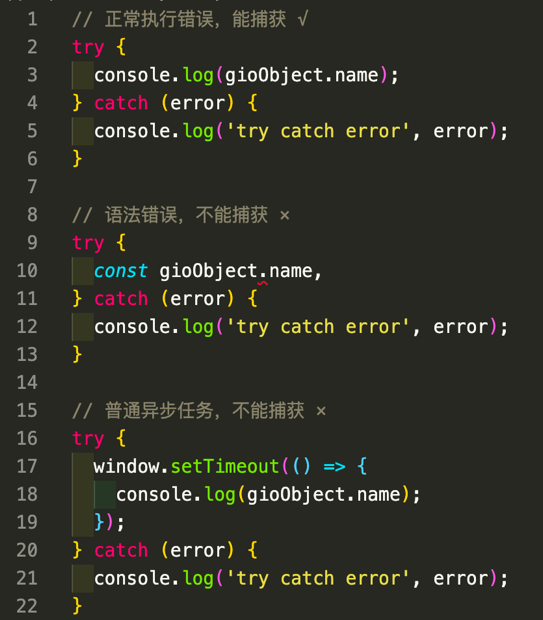
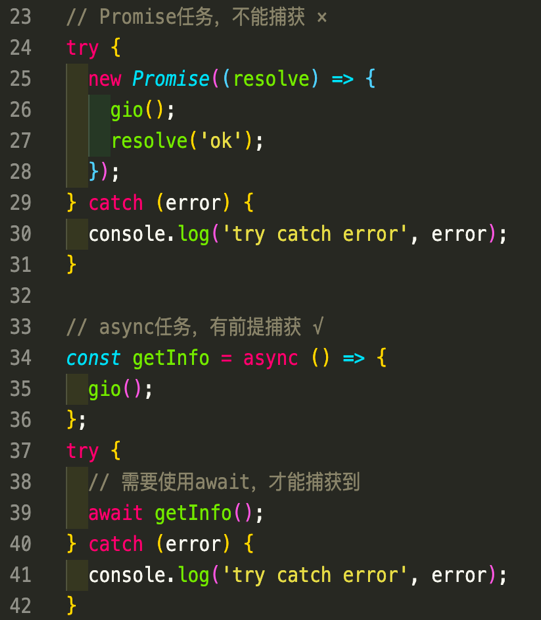
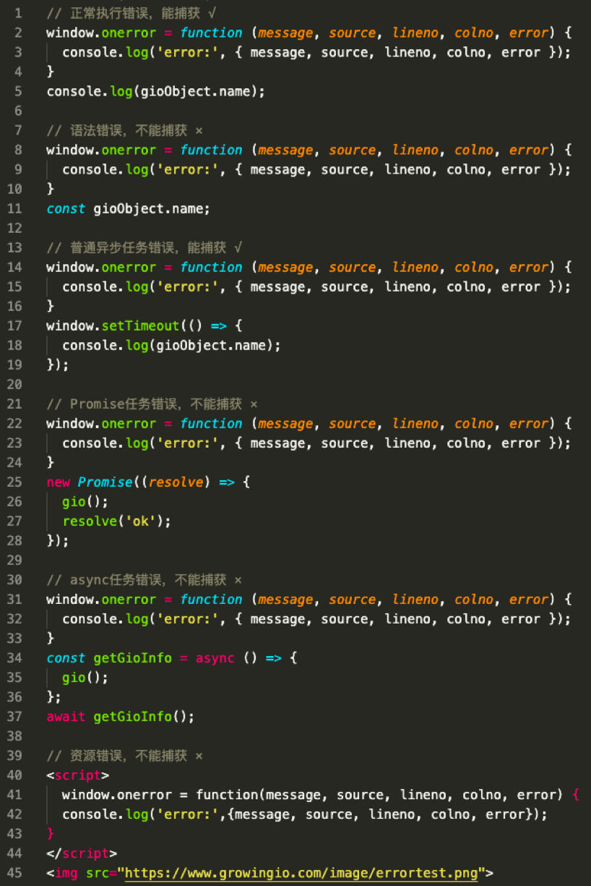
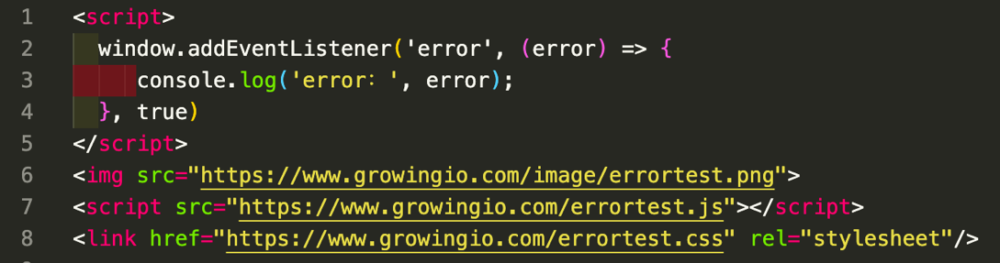
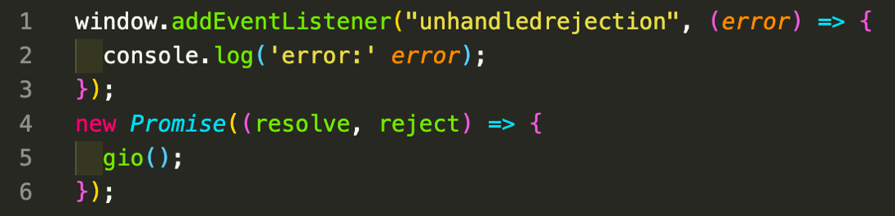
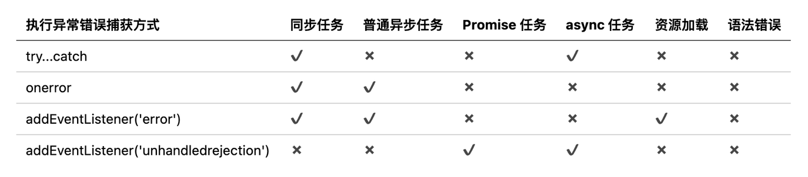
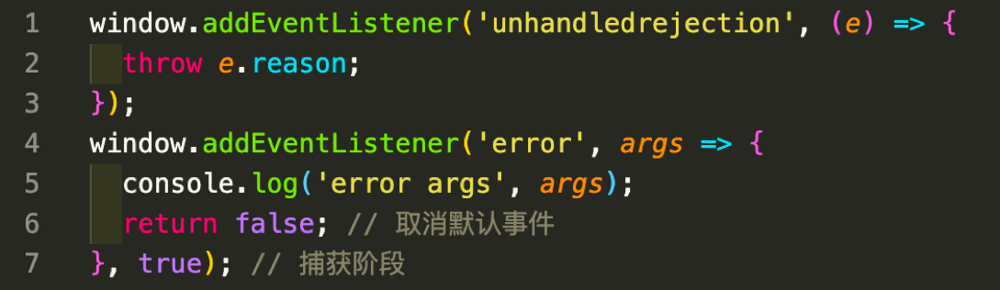
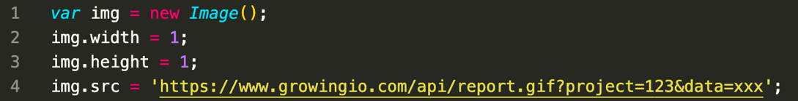
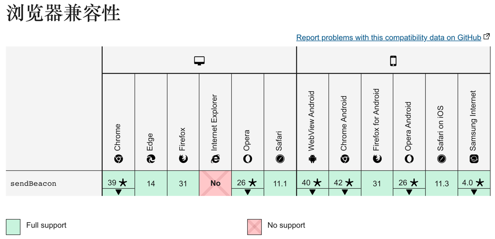
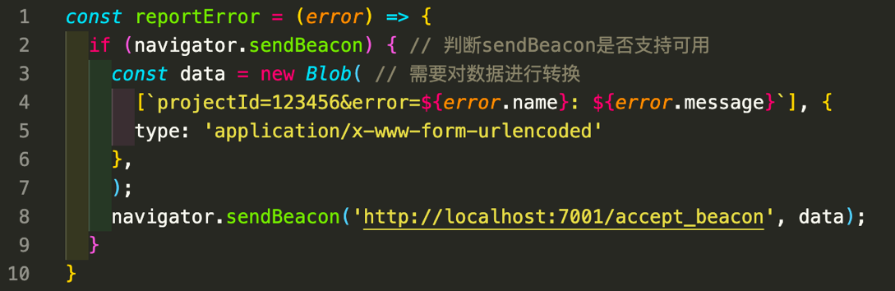

众所周知，几乎没有一个开发者能够做到开发时100%没有Bug，那么一旦我们的产品出了问题，快速定位问题是迫切需要做的事。好在我们在Web场景中Js运行出现异常不会导致JS引擎崩溃，最多只会终止当前执行的任务。然后逐级上抛错误，类似冒泡事件，在遇到最近的一层catch时停止上抛，如果中间都没有错误处理的catch时，直至window对象结束。那么今天就与大家一起探讨一下我们在Web场景中的异常错误数据如何收集以及如何上报。
<!--truncate-->
### 错误类型
想要获取到相对完整的异常错误数据，先要了解在Web中常见的异常错误都有哪些。

### Js执行错误
日常执行中主要有同步错误、语法错误、普通异步任务错误、Promise任务错误、async任务错误5种常见的异常错误。

### 资源加载错误
主要有图片、script、css、font等资源的加载错误问题。
### 错误捕获
try…catch
作为一个优秀的程序员，首先我们能想到的一定是 try…catch，那么我们直接上代码：

因为资源加载标签肯定不能在代码块中执行，因此资源加载错误肯定无法捕获。

基于上图结果，我们可以小结一下try…catch的处理能力：

能捕获包裹体内的同步执行错误。

不能捕获语法错误。

不能捕获异步任务错误。

不能捕获Promise任务错误。

不能捕获资源加载错误。

### window.onerror
我们浏览器在window对象上还自带了一个onerror的方法：

需要额外注意：跨域脚本加载错误只有一个“Script error”，并不能获取到错误信息。可以通过在 script 标签上添加“crossorigin”属性来解决这个问题。

基于上图结果，我们再小结一下window.onerror的处理能力：

能捕获所有同步执行错误。

不能捕获语法错误。

能捕获普通异步任务错误。

不能捕获Promise任务错误。

不能捕获async任务错误。

不能捕获资源加载错误。

### window.addEventListener(‘error’)
在Web页面上我们可以监听绝大多数事件，当然也包括错误事件，我们从字面意思上浅理解我们可以认为与onerror差不多，但是实际上它们俩的表现还是有一点区别，这里我们给出addEventListener额外能捕获的错误，其他与onerror基本一致：

这里要额外注意的是：如果是在js代码中new Image() 后加载出现的错误是无法捕获的。

相比window.onerror，通过window.addEventListener的方式我们可以捕获资源加载的错误。

### window.addEventListener(‘unhandledrejection’)
刚才我们介绍了3种常见的错误捕获方式，但都不能捕获Promise任务的错误，这里有人会说了，Promise不是可以自己catch吗？是的，但是我相信大多数情况下我们的开发同学可能并不会为每一个Promise写一个catch，或者可能出现漏写的情况。Js为我们准备了一个“兜底方案”: unhandledrejection事件监听。它会在Promise 被reject（抛错）且没有被catch的时候触发。下面上例子：

当然如果我们将没有catch的Promise放在async中去执行，unhandledrejection事件监听也能捕获到。所以async任务错误unhandledrejection事件监听也是可以支持捕获的。

**题外话：**我们可以看到这个事件的名称叫做unhandledrejection，作为一个英语词法敏锐的程序员，瞬间想到，有没有叫handledrejection的事件呢，如果有，我们是不是可以猜测作用刚好是相反呢？还真有！并且正如我们所猜测的，它是在Promise的reject做了处理（catch）后触发！这里我们就不展开谈论，有兴趣的同学可以研究一下。

回归正题，我们通过这么多例子测试了4种捕获错误的方式，总结得到下表：

那么我们观察这个表格，首先可以看到语法错误，4种方式都不能捕获，但是我们一般认为语法错误不应该在执行阶段才发现，在我们的编译以及测试环节就可以检查出，所以我们不考虑将其捕获。那么其他的异常错误我们发现通过 addEventListener('onerror') + addEventListener('unhandledrejection') 的方式恰好能够覆盖5种异常错误的捕获，一起来实现一下：

把Promise及async任务中的错误捕获后用同步的逻辑抛出即可让onerror准确捕获到。

如此，我们就可以将我们Web中大部分的异常问题进行准确捕获。

接下来我们看看如何将错误问题上报至我们的服务器进行汇总。

## 数据上报
### XMLHttpRequest
我们想要将数据传回服务器，最通用的方式当然就是ajax请求，通过浏览器的XMLHttpRequest（这里我们不讨论IE）的send方法，发送post请求数据给服务端，这里我们不再给出实现。

其缺点也很明显：

有严格的跨域限制、携带cookie问题。

上报请求可能会阻塞业务。

请求容易丢失（被浏览器强制cancel）。

### Image
由于浏览器对资源文件的区别对待，为了解决上面的几个问题，我们可以通过创建一个1x1大小的图片进行异步加载的方式来上报。图片天然可跨域，又能兼容所有的浏览器，而js和css等其他资源文件则可能出现安全拦截和跨域加载问题。

但由于是一个get请求，上报的数据量在不同的浏览器下上限不一致（2kb-8kb），这就可能出现超出长度限制而无法上报完整数据的情况。因此，图片上报也是一个“不安全”的方式。

### SendBeacon
这个方法天生就是为了数据统计而设计的，它解决了XMLHttpRequest和图片上报的绝大部分弊端：没有跨域问题、不阻塞业务，甚至能在页面unload阶段继续发送数据，完美地解决了普通请求在unload阶段被cancel导致丢数据的问题，唯一的问题就是IE并不支持。

调用方式也非常简单，类似我们发送post请求：

这里需要注意的是，sendBeacon并不像XMLHttpRequest一样可以直接指定Content-Type，且不支持application/json等常见格式。data的数据类型必须是 ArrayBufferView 或 Blob, DOMString 或者 FormData 类型的。这里给出Blob类型的示例。

### 小结
基于以上3种上报方式，我们可以基本总结出，上报数据建议优先使用sendBeacon的方式，不支持的浏览器（例如IE）则降级使用图片上报，尽量避免直接使用XMLHttpRequest进行上报。

## 结语
目前你虽然GrowingIO Web SDK现在并没有对这些异常错误做完整的收集（因为我们的产品重点不在这），但是我们有需要的用户可以自己实现错误捕获的逻辑并使用SDK的埋点方法进行上报。

另外，我们正在Web SDK上进行架构演进且即将完成，创新性地提供了客户自定义插件的能力！后续您可以尝试通过SDK提供的插件能力，自行开发一个错误收集的插件（甚至是性能采集插件），配合SDK原有功能就能完成业务运营数据和开发所需的错误、性能数据的采集！敬请期待！

以上就是我们今天为大家分享的Web应用Js异常错误收集的内容。
### 参考文献：

https://developer.mozilla.org/zh-CN/docs/Web/JavaScript/Reference/Statements/try...catch

https://developer.mozilla.org/zh-CN/docs/Web/API/GlobalEventHandlers/onerror

https://developer.mozilla.org/zh-CN/docs/Web/API/EventTarget/addEventListener

https://developer.mozilla.org/zh-CN/docs/Web/API/Window/unhandledrejection_event

https://developer.mozilla.org/zh-CN/docs/Web/API/Navigator/sendBeacon