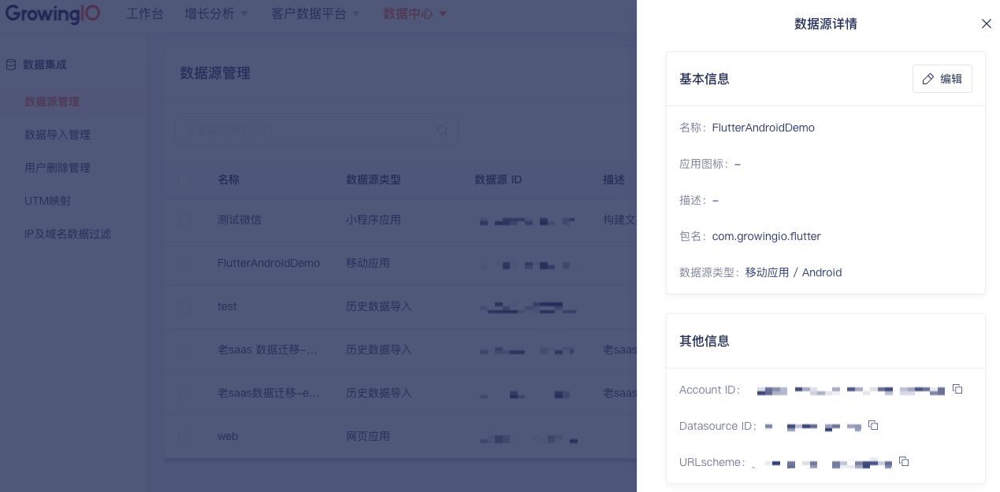

import Tabs from '@theme/Tabs';
import TabItem from '@theme/TabItem';

### 集成准备
#### 获取SDK初始化必传参数：Account ID、DataSource ID、URL Scheme、Host
:::info
AccountID：项目ID，代表一个项目<br/>
DataSourceID：数据源ID，代表一个数据源<br/>
URL Scheme： 是 GrowingIO SDK 从外部唤醒应用时使用的唯一标识<br/>
Host：采集数据上报的服务器地址<br/>

Account ID、DataSource ID、URL Scheme 需要在CDP增长平台上新建数据获取源，或从已知应用中获取, 如不清楚或无权限请联系您的专属项目经理或技术支持<br/>
Host 需要服务端部署，如不清楚请联系您的专属项目经理或技术支持
:::
##### 创建

##### 查看


## 集成无埋点SDK
### 添加依赖
在 project 级别的build.gradle文件中添加autotracker-gradle-plugin依赖。

```groovy
buildscript {
    repositories {
        // 添加maven仓库
        mavenCentral()
        //如果使用 SNAPSHOT 版本，则需要使用如下该仓库。
        maven { url "https://s01.oss.sonatype.org/content/repositories/snapshots/" }
    }
    dependencies {
        
        //GrowingIO 无埋点 SDK plugin
        classpath 'com.growingio.android:autotracker-gradle-plugin:3.3.5'
    }
}
```

如果项目中使用的Android Gradle插件为7.0及以上版本，需要在 project 中的settings.gradle文件中添加Maven仓库

```groovy
// 当AGP版本为7.0及以上添加
dependencyResolutionManagement {
    repositoriesMode.set(RepositoriesMode.FAIL_ON_PROJECT_REPOS)
    repositories {
        // 添加maven仓库，AndroidStudio会自动设置，如果已经存在不需要重复添加
        mavenCentral()
        //如果使用 SNAPSHOT 版本，则需要使用如下该仓库。
        maven { url "https://s01.oss.sonatype.org/content/repositories/snapshots/" }
    }
}
```
如果项目中使用的Android Gradle插件为4.2及以下版本，则需要在 project 级别的build.gradle文件中添加Maven仓库

```groovy
// 当AGP版本为4.2及以下添加
allprojects {
    repositories {
        // 添加maven仓库
        mavenCentral()
        //如果使用 SNAPSHOT 版本，则需要使用如下该仓库。
        maven { url "https://s01.oss.sonatype.org/content/repositories/snapshots/" }
    }
}
```

在 app及module 级别的 `build.gradle` 文件中添加 `com.growingio.android.autotracker` 插件、`autotracker`依赖。
```groovy
apply plugin: 'com.android.application'
//添加 GrowingIO 插件
apply plugin: 'com.growingio.android.autotracker'

...

dependencies {
    ...
    //GrowingIO 无埋点 SDK
    implementation 'com.growingio.android:autotracker-cdp:3.3.5'
}

```

:::tip 关于版本
最新版本请参考 [Github Release](https://github.com/growingio/growingio-sdk-android-autotracker/releases)
:::

### 添加URL Scheme
URL Scheme 是 GrowingIO SDK 从外部唤醒应用时使用的唯一标识。把 URL Scheme 添加到您的项目，以便使用圈选,[Mobile Debugger](/docs/debugverify/mobiledebugger) 及深度链接等功能时唤醒应用。
将应用的 URLScheme 和应用权限添加到您的 AndroidManifest.xml 中的 LAUNCHER Activity 下。

```xml
<?xml version="1.0" encoding="utf-8"?>
<manifest xmlns:android="http://schemas.android.com/apk/res/android"
    package="com.example.growingio.testdemo">
​
    <uses-permission android:name="android.permission.INTERNET" />

    <application
        android:name=".YourApplication"
        android:allowBackup="true"
        android:icon="@mipmap/ic_launcher"
        android:label="@string/app_name"
        android:roundIcon="@mipmap/ic_launcher_round"
        android:supportsRtl="true"
        android:theme="@style/AppTheme">
        <activity android:name=".LauncherActivity">
            <intent-filter>
                <action android:name="android.intent.action.MAIN" />
                <category android:name="android.intent.category.LAUNCHER" />
            </intent-filter>
            <!--请添加这里的整个 intent-filter 区块，并确保其中只有一个 data 字段-->
            <intent-filter>
                <data android:scheme="growing.您的URL Scheme" />
                <action android:name="android.intent.action.VIEW" />
                <category android:name="android.intent.category.DEFAULT" />
                <category android:name="android.intent.category.BROWSABLE" />
            </intent-filter>
            <!--请添加这里的整个 intent-filter 区块，并确保其中只有一个 data 字段-->
        </activity>
    </application>
</manifest>
```
### SDK初始化配置

#### 请将 SDK 的初始化代码放入 `Application` 的 `onCreate` 中。为使 App 合规，请参考[合规步骤](/docs/compliance/androidCompliance#合规步骤) 
<Tabs
  groupId="code-language"
  defaultValue="kotlin"
  values={[
    {label: 'java', value: 'java'},
    {label: 'kotlin', value: 'kotlin'},
  ]
}>

<TabItem value="java">

```java
public class MyApplication extends Application {
    @Override
    public void onCreate() {
        super.onCreate();

        // Config GrowingIO
        // YourAccountId eg: 0a1b4118dd954ec3bcc69da5138bdb96
        // Your URLScheme eg: growing.xxxxxxxxxxx
        // YourServerHost eg: https://api.growingio.com 需要填写完整的url地址
        // YourDatasourceId eg: 11223344aabbcc
        CdpAutotrackConfiguration sConfiguration = new CdpAutotrackConfiguration("Your AccountId", "Your URLScheme")
                .setDataCollectionServerHost("Your ServerHost")
                .setDataSourceId("Your DataSourceId")
                .setDebugEnabled(BuildConfig.DEBUG);
        GrowingAutotracker.startWithConfiguration(this,sConfiguration);
    }
}
```

</TabItem>
<TabItem value="kotlin">

```kotlin
class MyApplication : Application() {
    override fun onCreate() {
        super.onCreate()

        // Config GrowingIO
        // YourAccountId eg:0a1b4118dd954ec3bcc69da5138bdb96
        // Your URLScheme eg:growing.xxxxxxxxxxx 
        // YourServerHost eg:http://106.75.81.105:8080
        // YourDatasourceId eg: 11223344aabbcc
        val sConfiguration = CdpAutotrackConfiguration("Your AccountId", "Your URLScheme")
            .setDataCollectionServerHost("Your ServerHost")
            .setDataSourceId("Your DataSourceId")
            .setDebugEnabled(BuildConfig.DEBUG)
        GrowingAutotracker.startWithConfiguration(this, sConfiguration)
    }
}
```

</TabItem>
</Tabs>


:::caution 注意
`GrowingAutotracker.startWithConfiguration`第一个参数为 `ApplicationContext` 对象。 
:::


### 代码混淆
如果您启用了混淆，请在您的 proguard-rules.pro 中加入如下代码：
```xml
-keep class * extends com.growingio.android.sdk.GeneratedGioModule
-keep class * extends com.growingio.android.sdk.LibraryGioModule
```


### 查看集成效果
运行应用，若 `Logcat` 中输出了  
`!!! Thank you very much for using GrowingIO. We will do our best to provide you with the best service. !!!`  
`!!! GrowingIO Tracker version: 3.3.4 !!!`  
则说明SDK已经集成成功。

若在初始化中打开了Debug `setDebugEnabled(true)` ，则可以在 `Logcat` 中看到每个事件的log日志输出。

至此，就完成了无埋点 SDK 的集成。

另外，您可使用 [GioKit 辅助插件](/docs/giokit/android) 进行集成验证。


## 集成埋点SDK
埋点 SDK只自动采集用户访问事件和APP关闭事件，其他事件均需要开发同学调用相应埋点 API 采集埋点事件。
埋点相较于无埋点集成步骤会更简单，也不需要添加额外的插件。

### 添加依赖
在 project 级别下的 `build.gradle` 文件中添加仓库
```groovy
repositories {
    mavenCentral()
}
```

在 module 级别的 `build.gradle` 文件中添加tracker依赖。

```groovy
dependencies {

    //GrowingIO 埋点 SDK
    implementation 'com.growingio.android:tracker-cdp:3.3.5'
}
```

### 添加URLScheme
以便唤醒App
```xml
<?xml version="1.0" encoding="utf-8"?>
<manifest xmlns:android="http://schemas.android.com/apk/res/android"
    package="com.example.growingio.testdemo">
​
    <uses-permission android:name="android.permission.INTERNET" />

    <application
        android:name=".YourApplication">
        <activity android:name=".LauncherActivity">
            <intent-filter>
                <action android:name="android.intent.action.MAIN" />
                <category android:name="android.intent.category.LAUNCHER" />
            </intent-filter>
            <!--请添加这里的整个 intent-filter 区块，并确保其中只有一个 data 字段-->
            <intent-filter>
                <data android:scheme="growing.您的URLScheme" />
                <action android:name="android.intent.action.VIEW" />
                <category android:name="android.intent.category.DEFAULT" />
                <category android:name="android.intent.category.BROWSABLE" />
            </intent-filter>
            <!--请添加这里的整个 intent-filter 区块，并确保其中只有一个 data 字段-->
        </activity>
    </application>
</manifest>
```
### SDK初始化配置
#### 请将 SDK 的初始化代码放入 `Application` 的 `onCreate` 中。为使 App 合规，请参考[合规步骤](/docs/compliance/androidCompliance#合规步骤) 
<Tabs
  groupId="code-language"
  defaultValue="kotlin"
  values={[
    {label: 'java', value: 'java'},
    {label: 'kotlin', value: 'kotlin'},
  ]
}>

<TabItem value="java">

```java
public class MyApplication extends Application {
    @Override
    public void onCreate() {
        super.onCreate();
        // Config GrowingIO
        // YourAccountId eg: 0a1b4118dd954ec3bcc69da5138bdb96
        // Your URLScheme eg: growing.xxxxxxxxxxx
        // YourServerHost eg: https://api.growingio.com 需要填写完整的url地址
        // YourDatasourceId eg: 11223344aabbcc
        CdpTrackConfiguration sConfiguration = new CdpTrackConfiguration("Your AccountId", "Your URLScheme")
                .setDataCollectionServerHost("Your ServerHost")
                .setDataSourceId("Your DataSourceId")
                .setDebugEnabled(BuildConfig.DEBUG);
        GrowingTracker.startWithConfiguration(this, sConfiguration);
    }
}
```

</TabItem>
<TabItem value="kotlin">

```kotlin
class MyApplication : Application() {
    override fun onCreate() {
        super.onCreate()
        // Config GrowingIO
        // YourAccountId eg: 0a1b4118dd954ec3bcc69da5138bdb96
        // Your URLScheme eg: growing.xxxxxxxxxxx
        // YourServerHost eg: https://api.growingio.com 需要填写完整的url地址
        // YourDatasourceId eg: 11223344aabbcc
        val sConfiguration: CdpTrackConfiguration =
            CdpTrackConfiguration("Your AccountId", "Your URLScheme")
                .setDataCollectionServerHost("Your ServerHost")
                .setDataSourceId("Your DataSourceId")
                .setDebugEnabled(BuildConfig.DEBUG)
        GrowingTracker.startWithConfiguration(this, sConfiguration)
    }
}
```

</TabItem>
</Tabs>

### 混淆
SDK中已经默认集成了混淆规则，R8 在编译项目时会自动应用其规则。
如果混淆后还出现问题，可以在您的 proguard-rules.pro 中加入如下代码：
```xml
-keep class com.growingio.** {
    *;
}
-dontwarn com.growingio.**
```

### 查看集成效果
运行应用，若 `Logcat` 中输出了  
`!!! Thank you very much for using GrowingIO. We will do our best to provide you with the best service. !!!`  
`!!! GrowingIO Tracker version: 3.3.4 !!!`  
则说明SDK已经集成成功。

若在初始化中打开了Debug `setDebugEnabled(true)` ，则可以在 `Logcat` 中看到每个事件的log日志输出。

至此，就完成了埋点 SDK 的集成。

另外，您可使用 [GioKit 辅助插件](/docs/giokit/android) 进行集成验证。
