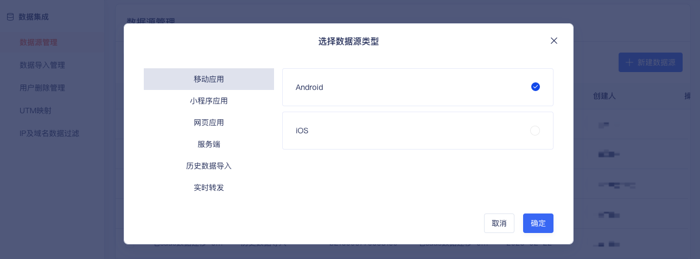
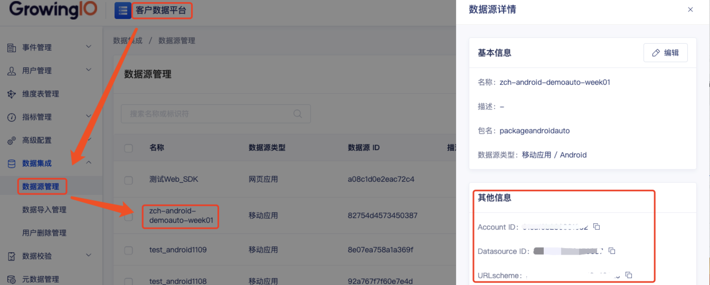

Android SDK 提供了 [无埋点SDK](/docs/android/base/Introduce#集成无埋点sdk) 和 [埋点SDK](/docs/android/base/Introduce#集成埋点sdk) 两个版本：
* 埋点SDK 只自动采集用户访问事件，需要开发同学调用相应埋点 API 采集埋点事件;
* 无埋点SDK 具备 埋点SDK 的所有功能，同时具备自动采集基本用户行为事件，如页面访问，点击事件等。

无埋点SDK（包括埋点 SDK）代码已托管在 [Github](https://github.com/growingio/growingio-sdk-android-autotracker) 上，欢迎 star,fork 一波。

## 集成准备
### 获取SDK初始化必传参数：Account ID、DataSource ID、URL Scheme、Host
:::info
AccountID：项目ID，代表一个项目<br/>
DataSourceID：数据源ID，代表一个数据源<br/>
URL Scheme： 是 GrowingIO SDK 从外部唤醒应用时使用的唯一标识<br/>
Host：采集数据上报的服务器地址<br/>

Account ID、DataSource ID、URL Scheme 需要在CDP增长平台上新建数据源，或从已创建的数据源中获取, 如不清楚或无权限请联系您的专属项目经理或技术支持<br/>
Host 需要服务端部署，如不清楚请联系您的专属项目经理或技术支持
:::
##### 创建

##### 查看


:::info
**Gradle插件版本**： 3.2.1及以上  
**Android系统版本**：Android 4.2及以上<br/>
**根据需要选择集成**  [<font color='red'>无埋点SDK</font>](/docs/android/base/Introduce#集成无埋点sdk)  或  [<font color='red'>埋点SDK</font>](/docs/android/base/Introduce#集成埋点sdk)
:::

```mdx-code-block
import DocCardList from '@theme/DocCardList';
import {useCurrentSidebarCategory} from '@docusaurus/theme-common';

<DocCardList items={useCurrentSidebarCategory().items}/>
```
