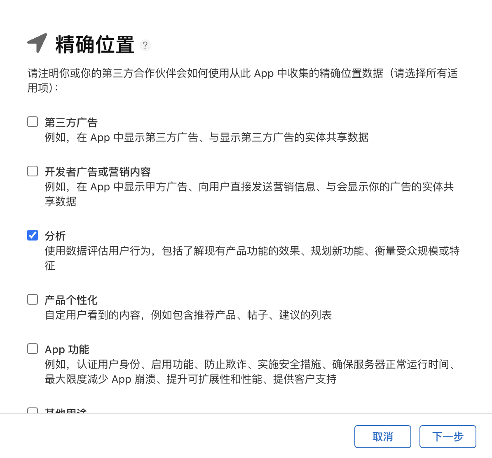

# APP合规指南
**鉴于您需要使用GIO提供的服务，请您务必于使用GIO服务之前完成如下合规工作：**
:::info
合规指南适用于[Android SDK](/docs/android/base/Getting%20Started) 和 [iOS SDK](/docs/ios/base/Getting_Started)
:::

## 1.隐私政策填写

### 1.1 收集和获取

在《隐私政策》中收集和获得您的个人信息栏目中根据实际情况填写以下内容。当您在激活使用时，我们会通过 SDK 收集您的设备信息（例如：`IDFA`、`IDFV`、操作系统、设备型号、系统版本、`AndroidID`、`IMEI` 等）用于统计分析您在 App 内的使用效果。

### 1.2 与授权合作伙伴共享

在《隐私政策》中的与授权合作伙伴共享栏目中根据实际情况填写以下内容。GrowingIO SDK：收集您的设备信息（例如：`IDFA`、`IDFV`、操作系统、设备型号、系统版本、`AndroidID`、`IMEI` 等）用于数据分析，从而改进我们的产品和服务。

### 1.3 设备信息说明

#### 1.3.1 IDFA

##### 使用途径

GrowingIO SDK 会采集 `IDFA` 和 `IDFV` 字段上传，如果您的项目中引入了 `AdSupport.framework`，会尝试获取 `IDFA`。除了 `IDFA` 和 `IDFV` 字段，SDK会生成 设备标识 ，其值使用 `IDFA` `IDFV` 和 `UUID` ，三者的优先级为 `IDFA`> `IDFV` > `UUID` ，例如：如果获取不到 `IDFA`，SDK 会使用 `IDFV` 。

##### 合规风险

当使用 `IDFA` 时有一定的合规风险，但是考虑到采集的准确性，GrowingIO仍然提供`IDFA`的采集方法，如果不需要采集`IDFA`，请在项目工程中去除 `AdSupport.framework` 的引用，并且不要在项目中导入 `AdSupport` 相关头文件。如果需要发布 儿童级应用 ，完全不需要相关 `IDFA` 的获取逻辑，会默认提供一份 不包含`IDFA` 的SDK版本，并没有发布在 Cocoapods ，请自行在官网下载。

###### 常见问题

Q1：App一开始禁止了`IDFA`权限，后续允许了`IDFA` 权限，数据会有什么变化？

A：对于`IDFA`，App生命周期内，`IDFA` 只会获取一次，就算后续 IDFA 权限打开了，也不会再获取，可以在下一次App启动后生效。对于 设备标识，仅且在 App第一次启动时生成，后续不再改变，优先级为 `IDFA`> `IDFV` > `UUID`，如果 `IDFA` 无法获取，则会使用`IDFV` 且不再变动，会存入`Keychain`，卸载也无法修改。如果要设备标识 和 `IDFA` 绑定，则需要在用户同意 `IDFA`权限之后进行第一次SDK初始化操作。

#### 1.3.2 AndroidId、IMEI、OAID、GoogleAdId

GrowingIO SDK在采集 设备标识 时，会默认采集 `AndroidId`，有一定的合规风险，但是考虑采集的准确性，GrowingIO 仍然提供 `AndroidId` 的采集方法。如果您不需要采集 `AndroidId`，请配置 `setDataCollectionEnabled`为 `false` ，此时SDK不获取任何设备信息，也不上报任何数据。

#### 1.4 三方SDK列表中建议示例
GIO移动端 SDK

用途：分析收集移动应用程序(App)用户的使用情况

收集个人信息类型：设备标识信息（如IMEI、Android ID、OAID、IDFA、IDFV），设备类型，设备版本，系统版本，地理位置信息，网络设备制造商，IP地址，网络模式

提供方：北京易数科技有限公司

第三方SDK隐私政策链接：https://accounts.growingio.com/user-privacy

## 2. SDK 如何支持合规

### 2.1 Android 合规步骤

SDK 提供了合规接口，可以设置在用户同意《隐私政策》后，开启数据采集。具体可以参考以下步骤：用户未同意隐私条款时，可以在 SDK 初始化配置时，调用 `setDataCollectionEnabled` 设置为 `false` 禁止数据采集（不获取 `AndroidId`，不获取任何设备信息，也不上报任何数据）。

当用户同意隐私条款时，调用 `setDataCollectionEnabled` 设置为 `true` 开启数据采集。

### 2.2 iOS 合规步骤

因为在 iOS 14 之后的 `IDFA` 权限需要用户授权，需要同意隐私条款之后才能获取到 `IDFA`。

SDK 提供了合规接口，在用户同意隐私条款前调用`dataCollectionEnabled`，设置为 `NO` 禁止采集数据，并初始化SDK ，待用户同意隐私条款后调用`dataCollectionEnabled`，设置为 `YES` 开启数据采集。

### 2.3 常见问题

Q1：延迟初始化之后，发现丢掉了部分事件

A：对于SDK初始化之前，或者开启数据采集之前发生的事件，一概丢弃。

## 3. App Store 广告标识符（IDFA）说明

SDK 不会主动获取 `IDFA` 权限，您需要自行获取 `IDFA` 权限, 请参考 iOS SDK [App Store提交应用注意事项](/docs/ios/base/Getting_Started#app-store提交应用注意事项)​

## 4. App Store 隐私问题

苹果在 iOS 14.3 系统更新了隐私政策，要求 App 更新或发布时需要发布者填写一份隐私报告。此时如果 App 集成 GrowingIO SDK 应该如何填写:

#### 1.  选择 「是，会从此 App 中收集数据」

​​

#### 2. GrowingIO 不会主动申请采集位置信息，如果客户的App申请获取了位置信息，GrowingIO就会采集位置信息用于定位用户城市级别的位置，需要勾选 「精准位置」

:::info
如果您想禁用位置信息获取，调用 `+setEnableLocationTrack:`为 `NO`
:::

#### 3. 默认情况下只需选择 「设备 ID」

如果使用的是 无埋点SDK 需继续选择 「产品交互」。如果使用用户关联，即调用 设置登录用户ID 接口则还需勾选 「用户 ID」，如图:

​​

### 4.1 位置

#### 1. 请在 「位置」面板中，勾选 「分析」

​​

#### 2. 然后下一步，勾选「是，从此 App 中收集的精确位置数据与用户身份关联」

​​

#### 3. 根据您App实际情况选择是否用于追踪目的

### 4.2 用户 ID

#### 1. GrowingIO SDK 会在调用 设置登录用户ID 接口时收集用户 ID 用于分析功能，因此这里选择「分析」，如图

​​

#### 2. 勾选后点击下一步，选择「是，从此 App 中收集的用户 ID 与用户身份关联」，这里根据具体的业务进行勾选，如图

​​

#### 3. 点击下一步，需要选择「是，我们会将用户 ID 用于追踪目的」​
​​
### 4.3 设备

#### 1. GrowingIO SDK 收集设备 ID 用于收集用户登录前的数据，因此这里继续选择「分析」，如图

​​

#### 2. 点击下一步，因为收集到的数据会与设备 id 绑定，所以此处继续选择「是」

​​

#### 3. 继续下一步，同用户 ID ， 会使用 IDFA 与第三方数据相关联以用于定向广告或广告评估目的，如图

​​

### 4.4 产品交互

#### 1. 使用 GrowingIO 无埋点SDK后，会收集 APP启动，APP退出，用户点击，页面浏览等相关行为用于分析产品，因此这里继续选择「分析」，如图

​​

#### 2. 点击下一步，继续选择是，如图

​​

#### 3. 最后追踪目的，请根据您实际情况选择，是否要用于追踪目的

## 5. GrowingIO SDK 合规性说明

GrowingIO SDK 默认收集的数据类型只有「设备 ID」和「用户 ID」主要用于追踪，其他的数据类型采集需要根据自己的采集业务以及选择的SDK 功能来做相应选择：

* 调用 设置登录用户ID 接口：需选择「用户 ID」

* 使用无埋点 SDK：需选择「产品交互」

* 开启崩溃收集：需选择「崩溃数据」

* 开启经纬度采集：需选择「精确位置」

另，该隐私政策的填写是可以更改的。**请根据自己 App 业务的调整及时更新隐私政策**。

## 6. 隐私条款
《中华人民共和国个人信息保护法》（简称《个保法》）于2021年11月1日正式施行；《中华人民共和国数据安全法》（简称《数据安全法》）也于2021年9月1日开始施行。GrowingIO 亦根据中国法律法规的要求制定了GrowingIO关于最终用户个人信息的隐私条款，具体如下链接：
:::info
​[GrowingIO 个人隐私条款​](https://accounts.growingio.com/user-privacy)
:::
可以根据您平台或APP隐私政策的需要，选择是否向最终用户公开该个人隐私条款。

​

您应知晓，GrowingIO会不时更新该合规指南。届时，GrowingIO会通知您具体更新的内容，还请您参考新的合规指南完成合规性操作。
