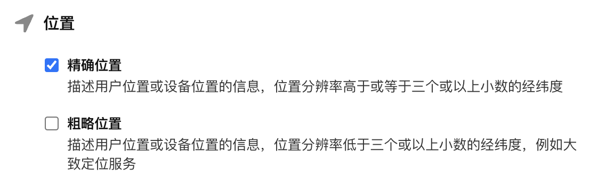

## 隐私协议

根据[工业和信息化部关于开展纵深推进APP侵害用户权益专项整治行动](http://www.gov.cn/zhengce/zhengceku/2020-08/02/content_5531975.htm)和 [User Privacy and Data Use](https://developer.apple.com/app-store/user-privacy-and-data-use/)
，App 需要通过隐私协议说明应用采集数据。

为确保您的App在集成 GrowingIO SDK 之后，能够满足工信部相关合规要求，请参考以下说明。

## 隐私协议填写

### 收集和获取

在您的APP《隐私协议》中收集和获得的个人信息栏目中根据**实际情况**填写如下内容：
```
我们的产品集成了GrowingIO SDK，我们会通过 GrowingIO SDK 收集您的设备信息（例如：`IDFA`、`IDFV`、操作系统、设备型号、系统版本）用于统计分析您在 App 内的使用效果，从而改进我们的产品和服务。
```
可在第三方SDK列表中增加如下内容(设备信息按照**实际情况**填写)：
```
GIO移动端 SDK
用途：分析收集移动应用程序(App)用户的使用情况
收集个人信息类型：设备标识信息（如IDFA、IDFV），设备类型，设备版本，系统版本，地理位置信息，网络设备制造商，网络模式
提供方：北京易数科技有限公司
第三方SDK隐私协议链接：https://accounts.growingio.com/user-privacy
```

### 与授权合作伙伴共享

在您的APP《隐私协议》中的与授权合作伙伴共享栏目中根据**实际情况**填写如下内容:
```
我们的产品集成了GrowingIO SDK，我们会通过 GrowingIO SDK 收集您的设备信息（例如：`IDFA`、`IDFV`、操作系统、设备型号、系统版本）用于统计分析您在 App 内的使用效果，从而改进我们的产品和服务。
```

## 合规步骤
1.您需要确保 App 有《隐私协议》，并且在用户第一次启动 App 时就能向用户展示并取得用户同意；

2.请务必告知用户您使用了 GrowingIO SDK，请在 《隐私协议》 中添加隐私条款，参考[隐私协议填写](#隐私协议填写)

3.延迟初始化

集成 [iOS SDK](/docs/ios/Introduce)，请在用户同意《隐私协议》之后再初始化 GrowingIO SDK。 
示例代码如下：
```c
- (BOOL)application:(UIApplication *)application didFinishLaunchingWithOptions:(NSDictionary *)launchOptions {
    if (<用户未同意隐私协议>) {
      // 展示隐私协议弹框，等待用户同意后，添加 GrowingIO SDK 初始化代码
    } else {
        //  GrowingIO SDK 初始化代码
    }
    ...
    return YES;
}
```

4.集成了 GrowingIO SDK，默认会尝试获取 `IDFA`、`IDFV` 信息，用于统计分析用户在 App 内的使用效果。
参考：[App Store 提交应用注意事项​​](/docs/ios/Introduce#app-store提交应用注意事项)

## iOS 权限说明
| 权限 | 用途 | 
| :--: | :-- | 
| 网络 | 允许应用程序联网和发送数据权限，以便提供统计分析服务。必须权限|
| IDFA | 允许应用获取 IDFA，以便标识匿名用户。可选权限 | 

## 数据加密传输说明
采集 SDK 版本>=3.3.2，初始化配置时 encryptEnabled设置为YES，网络传输内容将会加密，不会明文显示。
使用请参考[SDK数据加密传输 encryptEnabled](/docs/ios/Configuration#12-encryptenabled)。

## 数据存储发送策略说明
iOS SDK 采集的用户行为数据支持设置发送间隔(最小可设置5秒)，默认15秒，SDK 会先将行为数据存入 App 本地 sqlite 数据库中，然后以每隔间隔时间向服务器发送行为数据包（最大 500 条行为数据），首次请求之后，如果剩余行为数据量大于500条，则继续发送；否则等待下一次定时器轮询，行为数据发送成功后将在数据库中删除。数据库中未发送的行为数据会在7天之后删除。

## 其他说明
### 关于 GDPR
为符合
[​General Data Protection Regulation 欧盟通用数据保护条例](https://zh.wikipedia.org/wiki/%E6%AD%90%E7%9B%9F%E4%B8%80%E8%88%AC%E8%B3%87%E6%96%99%E4%BF%9D%E8%AD%B7%E8%A6%8F%E7%AF%84)​，GrowingIO SDK 提供 `dataCollectionEnabled` 设置接口，可在用户不同意数据采集时，设置为 `NO` 禁止数据采集；在用户同意数据采集时，设置为 `YES`，开启数据采集。示例代码如下：
```c
- (BOOL)application:(UIApplication *)application didFinishLaunchingWithOptions:(NSDictionary *)launchOptions {
    // 1. dataCollectionEnabled 设置为 NO
    // 设置禁止数据采集代码
    
    // 2.初始化 GrowingIO SDK
    // 初始化代码
  
    ...
    return YES;
}
​
// 某一时刻同意数据采集
- (void)userAcceptDataCollection {
    ...
    // 3. dataCollectionEnabled 设置为 YES
    // 设置开启数据采集代码
    ...
}

```


### 关于 IDFA 广告标识符
#### 使用途径

GrowingIO SDK 会采集 `IDFA` 和 `IDFV` 字段上传，如果您的项目中引入了 `AdSupport.framework`，会尝试获取 `IDFA`。

除了 `IDFA` 和 `IDFV` 字段，GrowingIO SDK 使用 访问用户ID 字段标识访问用户 ，其值使用 IDFA 、IDFV 或 随机字符串 ，三者的优先级为 IDFA> IDFV > 随机字符串 ，例如：如果获取不到 IDFA，SDK 会使用 IDFV 作为访问用户ID。

#### 合规风险

当使用 `IDFA` 时有一定的合规风险，但是考虑到采集的准确性，GrowingIO SDK 仍然提供`IDFA`的采集方法，如果不需要采集`IDFA`，请在项目工程中去除 `AdSupport.framework` 的引用，并且不要在项目中导入 `AdSupport` 相关头文件。

如果需要发布儿童级应用，完全不需要相关 `IDFA` 的获取逻辑，参考[禁用IDFA](/docs/ios/Configuration#1-禁用idfa)。

## App Store 隐私问题

苹果在 iOS 14.3 系统更新了隐私协议，要求 App 更新或发布时需要发布者填写一份隐私报告。此时如果 App 集成 GrowingIO SDK 应该如何填写:

### 1. 是否会从此 App 中收集数据
**选择 「是，会从此 App 中收集数据」**


​​

### 2. 位置数据收集
**GrowingIO SDK 不会主动申请采集位置信息，如果客户的App申请获取了位置信息，GrowingIO就会采集位置信息用于定位用户城市级别的位置，需要勾选 「精准位置」**

:::info
如果您想禁用位置信息获取，需调用 `+setEnableLocationTrack:`为 `NO`
:::


### 3. 标识符和使用数据收集

**默认情况下只需选择 「设备 ID」**

**如果使用用户关联，即调用 设置登录用户ID 接口则还需勾选 「用户 ID」**

**如果使用的是 无埋点SDK 需继续勾选 「产品交互」**


​​

### 4.1. 位置

#### 1. 请在 「位置」面板中，勾选 「分析」


​​

#### 2. 然后下一步，勾选「是，从此 App 中收集的精确位置数据与用户身份关联」

​

#### 3. 根据您App实际情况选择是否用于追踪目的

### 4.2 用户 ID

#### 1. GrowingIO SDK 会在调用 设置登录用户ID 接口时收集用户 ID 用于分析功能，因此这里选择「分析」，如图
​

#### 2. 勾选后点击下一步，选择「是，从此 App 中收集的用户 ID 与用户身份关联」，这里根据具体的业务进行勾选，如图


​​

#### 3. 点击下一步，需要选择「是，我们会将用户 ID 用于追踪目的」​
​

### 4.3 设备

#### 1. GrowingIO SDK 收集设备 ID 用于收集用户登录前的数据，因此这里继续选择「分析」，如图

​

#### 2. 点击下一步，因为收集到的数据会与设备 id 绑定，所以此处继续选择「是」

​

#### 3. 继续下一步，同用户 ID ， 会使用 IDFA 与第三方数据相关联以用于定向广告或广告评估目的，如图

​

### 4.4 产品交互

#### 1. 使用 GrowingIO 无埋点SDK后，会收集 APP启动，APP退出，用户点击，页面浏览等相关行为用于分析产品，因此这里继续选择「分析」，如图

​

#### 2. 点击下一步，继续选择是，如图

​

#### 3. 最后追踪目的，请根据您实际情况选择，是否要用于追踪目的

### 5. GrowingIO SDK 合规性说明

GrowingIO SDK 默认收集的数据类型只有「设备 ID」和「用户 ID」主要用于追踪，其他的数据类型采集需要根据自己的采集业务以及选择的SDK 功能来做相应选择：

* 调用 设置登录用户ID 接口：需选择「用户 ID」

* 使用无埋点 SDK：需选择「产品交互」

* 开启崩溃收集：需选择「崩溃数据」

* 开启经纬度采集：需选择「精确位置」

另，该隐私协议的填写是可以更改的。**请根据自己 App 业务的调整及时更新隐私协议**。

