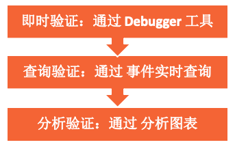

SDK集成和代码实施后，我们当然需要对数据的正确性和是否成功上传进行校验。

## 校验工作分为三步完成



### 即时校验
GrowingIO 即时校验工具有日志输出。Android 和 iOS APP 同时也支持 [Mobile Debugger](/docs/debugverify/mobiledebugger)、[GioKit](/docs/giokit)。<br/>
即时校验可以确保SDK采集数据的正确性，不能确保数据已上报到服务端数据库，[数据未上报到服务端数据库排查建议](question/common#3-sdk-集成成功但是数据库中没有查到sdk上报的数据)。

### 查询验证
在平台中，平台管理--->客户数据平台--->数据校验--->[事件实时查询](https://docs.growingio.com/op-help/docs/2.3/product-manual/customer-data-platform/data-audit/realtime-audit)功能，输入访问用户ID/登录用户ID 点击查询用户所有事件数据(用户属性事件除外)。

### 分析校验
在平台中，点击项目--->分析模型--->[事件分析](https://docs.growingio.com/op-help/docs/2.3/product-manual/product-analysis/event-analysis/)功能，选择需要分析的指标，添加指标和属性拆解，切换时间范围，切换数据展示样式，查看采集数据展示效果。

## 校验工具说明和应用场景推荐

|    工具/方法     |   依赖  |    功能简介   | 应用场景推荐 |
|   :------:      | :----: |  :-------:   | :----:|
|    日志输出      | 开启日志输出功能，研发开工具         | 可以查看所有采集事件日志数据 | 研发开发和排查问题 |
| Mobile Debugger | 手机与电脑端在同一局域网，仅APP可用  |  [可查看所有采集事件数据](/docs/debugverify/mobiledebugger) |  研发、分析师数据校验 |
|     GioKit      | 需添加GIOKit，仅 APP Debug包可用    |  [可查所有采集事件数据和上报结果](/docs/giokit) |  研发、分析师数据校验 |
|      查询验证    | 平台中有对应功能的使用权限           | 查询除用户属性事件外的其他事件数据 | 分析师校验排查问题 |
|      分析校验    | 平台中有对应功能的使用权限           | 查看采集数据展示效果 | 分析师看板分析问题 |


## 校验时需关注字段和说明
GrowingIO SDK 支持以下事件类型的数据上报。下面将列举校验时需要关注的字段数据，其他字段数据请参考[测量协议](/docs/Measurement%20Protocol#用户属性事件login_user_attributes)。对于埋点事件和用户属性事件，还需要关注事件的触发时机、attributes中的key和value 是否与埋点方案规划一致。

|   事件类型         |   事件类型标识 |   关注字段及说明  |  
|   :------:        |  :------:    | :----          |  
| 访问事件           |    VISIT     | eventType：事件类型 访问事件 VISIT<br/>appVersion：应用的版本号<br/>dataSourceId：设置的dataSourceId<br/>deviceId：访问用户ID  标识一台设备<br/>domain: 包名或域名 <br/>platform: 应用平台类型<br/>platformVersion：操作系统版本号<br/>sdkVersion：GIO SDK 版本号<br/>sessionId：访问SessionID 标识一次访问<br/>urlScheme：设置的 URL Scheme<br/>userId：登录用户ID<br/>|
| 页面浏览事件        |     PAGE     | eventType：事件类型 页面浏览事件为 PAGE<br/>title: 页面标题  可能有的页面没有<br/>path：页面路径 SDK 会为每个页面按页面层次生成<br/>referralPage: 来源页面，一般为上一个页面<br/>query： url 中的查询参数|
| 元素点击事件        |  VIEW_CLICK  | path：页面路径 SDK 会为每个页面按页面层次生成<br/>textValue：元素文本内容<br/>index：列表元素序号<br/>xpath：元素在页面中的位置，按照元素间嵌套逻辑生成|
| 输入框改变内容事件   |  VIEW_CHANGE | path：页面路径 SDK 会为每个页面按页面层次生成<br/>textValue：元素文本内容<br/>index：列表元素序号<br/>xpath：元素在页面中的位置，按照元素间嵌套逻辑生成 |
| 表单提交事件        |  FORM_SUBMIT | path：页面路径 SDK 会为每个页面按页面层次生成<br/>index：列表元素序号<br/>xpath：元素在页面中的位置，按照元素间嵌套逻辑生成 |
| 埋点事件           |   CUSTOM     | eventType：事件类型  页面浏览事件为 CUSTOM<br/>eventName：埋点事件标识符，需与埋点方案保持一致<br/>attributes：埋点事件 的事件属性；包含 事件属性标识符和值；key value 形式展示|
| 用户属性事件        |LOGIN_USER_ATTRIBUTES| eventType： 事件类型  页面浏览事件为 LOGIN_USER_ATTRIBUTES<br/>attributes：登录用户属性 包括登录用户属性的 标识符和 对应的值|


```mdx-code-block
import DocCardList from '@theme/DocCardList';
import {useCurrentSidebarCategory} from '@docusaurus/theme-common';

<DocCardList items={useCurrentSidebarCategory().items}/>
```
