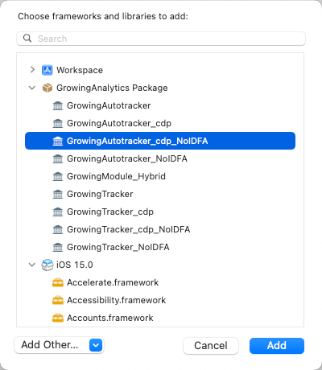

import Tabs from '@theme/Tabs';
import TabItem from '@theme/TabItem';

在初始化过程中，SDK 会接收一个由用户传入的默认配置 `Configuration`，配置相关说明如下表：

### 配置表格

| Config                       | 参数类型 | 是否必填 | 默认值 | 说明 | 其它 | 版本 |
| :-------------------------   | :------   | :----:  |:------  |:------| :---: | :------------------------:   |
| `projectId`                  | `NSString`  | 是      | `null`   | 项目 ID(AccountID)，每个应用对应唯一值 | - | - |
| `dataSourceId`            | `NSString`  | 是      | `null`   | 应用的 DataSourceId，唯一值 | - | - |
| `dataCollectionServerHost`| `NSString`  | 是      | `null`   | 服务端部署后的  ServerHost | - | - |
| `debugEnabled`            | `BOOL` | 否      | `NO`  | 调试模式，会打印 SDK log，抛出错误异常，在线上环境请关闭 | - | - |
| `cellularDataLimit`       | `NSUInteger`     | 否      | `10`     | 每天发送数据的流量限制，单位 MB | - | - |
| `dataUploadInterval`      | `NSTimeInterval`     | 否      | `15`     | 数据发送的间隔，单位秒 | - | - |
| `sessionInterval`         | `NSTimeInterval`     | 否      | `30`     | 会话后台留存时长，单位秒 | - | - |
| `dataCollectionEnabled`   | `BOOL` | 否      | `YES`   | 是否采集数据 | - | - |
| `excludeEvent`            | `int`     | 否      | `0`      | 设置事件过滤 | - | <font color='red'>>=3.2.1</font> |
| `ignoreField`             | `int`     | 否      | `0`      | 设置事件属性过滤 | - | <font color='red'>>=3.2.1</font> |
| `impressionScale`         | `float`   | 否      | `0`      | 元素曝光事件中的比例因子,范围 [0-1] | <font color='red'>无埋点独有</font> | - |
| `idMappingEnabled` | `BOOL` | 否 | `NO` | 是否开启多用户身份上报 | - | <font color='red'>>=3.3.0</font> |
| `urlScheme` | `NSString` | 否 | `nil` | 自定义 URL Scheme | - | <font color='red'>>=3.3.0</font> |
| `encryptEnabled` | `BOOL` | 否 | `NO` | 是否开启网络传输加密 | - | <font color='red'>>=3.3.2</font> |

### 详细说明

#### 1. **projectId**， **urlScheme**， **setDataSourceId**， **setDataCollectionServerHost**

urlScheme 是 SDK 3.3.0 及其之后必传参数，其他参数为必传参数，若不清楚具体数值请询问相关服务端对接的开发同事。

#### 2. **debugEnabled**

默认不开启，开启后会输出 SDK Log 日志。

#### 3. **cellularDataLimit**

为每日在 4G/5G 环境下的流量限制，默认为 10M。WIFI 环境下则不计流量。

#### 4. **dataUploadInterval**

上报间隔，GrowingIO SDK 会先将事件存入数据库中，然后以每隔默认时间 15 秒的情况下向服务器发送事件包（最大 500 条事件）。

#### 5. **sessionInterval**

设置会话后台留存时长，指当前会话在应用进入后台后的最大留存时间，默认为 30 秒。另外，其他情况下也会重新生成一个新的会话，如设置用户 ID 等核心信息，重新打开数据收集等。

#### 6. **dataCollectionEnabled**

数据收集，当数据收集关闭时，SDK 将不会再获取设备信息，也不会产生事件和上报事件。

#### 7. **excludeEvent**

> SDK 版本>=3.2.1

事件过滤，默认情况下，事件不会进行过滤。但若不想采集某些事件可以在此设置。事件类型可以参考 [GrowingEventFilter](https://github.com/growingio/growingio-sdk-ios-autotracker/blob/master/GrowingTrackerCore/Public/GrowingEventFilter.h)

#### 8. **ignoreField**

> SDK 版本>=3.2.1

事件属性过滤，事件属性指上报事件中携带的属性参数。可过滤事件属性可以参考 [GrowingFieldsIgnore](https://github.com/growingio/growingio-sdk-ios-autotracker/blob/master/GrowingTrackerCore/Public/GrowingFieldsIgnore.h)

#### 9. **impressionScale**

> 无埋点 SDK 独有

曝光比例，与曝光事件结合使用。曝光比例是指当一个曝光的 View 出现在屏幕时可见的部分占据自身尺寸的比例，比如说若设为 0 则表示只要出现即产生曝光事件，若设为 1 则表示要整个 View 都出现在屏幕中。

#### 10. **idMappingEnabled**

> SDK 版本>=3.3.0

多用户身份上报，是否支持多用户身份上报，默认不支持。与 API 接口`setLoginUserId:userKey:`对应，开启时，userKey 会在每次上报数据时携带；关闭时，接口与`setLoginUserId`作用相同

#### 11. **urlScheme**

> SDK 版本>=3.3.0

自定义 URL Scheme，如存在多环境配置，可基于不同环境进行自定义，需同时在工程中添加该 [URL Scheme](/docs/ios/Introduce#添加-url-scheme)

#### 12. **encryptEnabled**

> SDK 版本>=3.3.2，pod ENABLE_ENCRYPTION 已被废弃, 请使用 -[GrowingTrackConfiguration setEncryptEnabled] 进行配置

设置为 YES 时，网络传输内容将会加密，不会明文显示。

## 其他

### 1. **禁用IDFA**

:::info
采集 SDK 版本 >=3.2.0

:::
禁用 IDFA，且 SDK 中不会再有相关获取 IDFA 代码逻辑

<Tabs>
  <TabItem value="cocoapods" label="Cocoapods集成" default>

:::info
**使用时注意模块版本需要与采集 SDK 版本保持一致**
:::

在您的 Podfile 文件中添加

```c
pod 'GrowingAnalytics/DISABLE_IDFA'
```

打开终端，切换到项目目录，执行 `pod install` 或 `pod update`

  </TabItem>
  <TabItem value="swiftPM" label="Swift Package Manager集成">

去掉原先集成的 **GrowingAutotracker_cdp**(无埋点) / **GrowingTracker_cdp**(埋点) Package，选择对应的 **GrowingAutotracker_cdp_NoIDFA**(无埋点) / **GrowingTracker_cdp_NoIDFA**(埋点)  Package



  </TabItem>
</Tabs>

项目中无需其他额外设置
