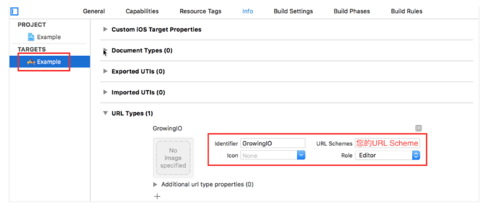

import Tabs from '@theme/Tabs';
import TabItem from '@theme/TabItem';

iOS SDK 提供了 <font color='red'> 无埋点SDK </font>或<font color='red'> 埋点SDK </font>  两个版本：
* 埋点SDK 只自动采集用户访问事件，需要开发同学调用相应埋点 API 采集自定义事件;
* 无埋点SDK 具备 埋点SDK 的所有功能，同时具备自动采集基本用户行为事件，如页面访问，点击事件等。

无埋点SDK（包括埋点 SDK）代码托管在 [Github](https://github.com/growingio/growingio-sdk-ios-autotracker-cdp)

欢迎 star,fork 一波。
:::info
**开发环境:** <br/>
Xcode 9.0 及以上  
iOS 8.0 及以上

**根据需要选择集成**<font color='red'> 无埋点SDK </font>或<font color='red'> 埋点SDK </font>
:::
## 无埋点SDK集成

### 1. Cocoapods集成

在您的Podfile文件中添加

```c
pod 'GrowingAnalytics-cdp/Autotracker'
```
打开终端，切换到项目目录
执行 `pod install` 或 `pod update`
### 2. 添加 URL Scheme

URL Scheme 是您在 GrowingIO 平台创建应用时生成的该应用的唯一标识。把 URL Scheme 添加到您的项目，以便使用Mobile Debug等功能时唤醒您的应用。  
:::info
需要在GrowingIO网站上先创建您的App应用，获取 URL Scheme
:::
选择工程 → Target  → Info  → URL Types → 点击 ➕  → 添加您的 URL Scheme 即可



### 3. SDK初始化配置
#### 获取 `AccountID`、`DataSourceID`、`Host`信息
:::info
`AccountID`、`DataSourceID`需要在CDP增长平台上新建数据源，或从已知应用中获取, 如不清楚或无权限请联系您的专属项目经理<br/>
`Host`需要服务端部署，如不清楚请联系您的专属项目经理
:::
##### 创建

##### 查看

#### 导入头文件`"GrowingAutotracker.h"`，并将以下代码加在您的`AppDelegate` 的 `application:didFinishLaunchingWithOptions:` 方法中  
   代码示例:
```c
#import "GrowingAutotracker.h"
```

```c
// Config GrowingIO
// YourAccountId eg: 0a1b4118dd954ec3bcc69da5138bdb96
// YourServerHost eg: https://api.growingio.com 需要填写完整的url地址
// YourDatasourceId eg: 11223344aabbcc
GrowingAutotrackConfiguration *configuration = [GrowingAutotrackConfiguration configurationWithProjectId:@"YourAccountId"];
configuration.dataCollectionServerHost = @"YourServerHost";
configuration.dataSourceId = @"YourDatasourceId";
[GrowingAutotracker startWithConfiguration:configuration launchOptions:launchOptions];
```
####  在appDelegate.m文件中实现 URL Scheme 跳转以及DeepLink跳转的代理方法

```c
// URL Scheme跳转
- (BOOL)application:(UIApplication *)application
            openURL:(NSURL *)url
  sourceApplication:(NSString *)sourceApplication
         annotation:(id)annotation {

    return NO;
}

// universal Link执行
- (BOOL) application:(UIApplication *)application
continueUserActivity:(NSUserActivity *)userActivity
  restorationHandler:(void (^)(NSArray<id <UIUserActivityRestoring>> *_Nullable))restorationHandler {
    return YES;
}
```

#### 若使用了iOS 13的 UIScene，请在您指定的SceneDelegate中设置如下

```c
- (void)scene:(UIScene *)scene continueUserActivity:(NSUserActivity *)userActivity {
}

- (void)scene:(UIScene *)scene openURLContexts:(NSSet<UIOpenURLContext *> *)URLContexts {
}
```
:::info
上述代理方法空实现即可，SDK会自动加入处理代码
:::

## 埋点SDK集成

埋点 SDK只自动采集用户访问事件和APP关闭事件，其他事件均需要开发同学调用相应埋点 API 采集自定义事件。

### 1. Cocoapods集成

在您的Podfile文件中添加

```c
pod 'GrowingAnalytics-cdp/Tracker'
```
打开终端，切换到项目目录
执行 `pod install` 或 `pod update`
### 2. 添加 URL Scheme

URL Scheme 是您在 GrowingIO 平台创建应用时生成的该应用的唯一标识。把 URL Scheme 添加到您的项目，以便使用Mobile Debug等功能时唤醒您的应用。  
:::info
您需要在CDP增长平台上先创建您的App应用，获取 URL Scheme
:::
选择工程 -> Target -> Info -> URL Types -> 添加您的 URL Scheme 即可


### 3. SDK初始化配置
#### 获取 `AccountID`、`DataSourceID`、`Host`信息
:::info
`AccountID`、`DataSourceID`需要在CDP增长平台上新建数据源，或从已知应用中获取, 如不清楚或无权限请联系您的专属项目经理<br/>
`Host`需要服务端部署，如不清楚请联系您的专属项目经理
:::
##### 创建

##### 查看


#### 导入头文件`"GrowingTracker.h"`，并将以下代码加在您的`AppDelegate` 的 `application:didFinishLaunchingWithOptions:` 方法中  
代码示例:

```c
#import "GrowingTracker.h"
```

```c
// Config GrowingIO
// YourAccountId eg: 0a1b4118dd954ec3bcc69da5138bdb96
// YourServerHost eg: https://api.growingio.com 需要填写完整的url地址
// YourDatasourceId eg: 11223344aabbcc
GrowingTrackConfiguration *configuration = [GrowingTrackConfiguration configurationWithProjectId:@"YourAccountId"];
configuration.dataCollectionServerHost = @"YourServerHost";
configuration.dataSourceId = @"YourDatasourceId";
[GrowingTracker startWithConfiguration:configuration launchOptions:launchOptions];
```

#### 在appDelegate.m文件中实现 URL Scheme 跳转以及DeepLink跳转的代理方法

```c
// URL Scheme跳转
- (BOOL)application:(UIApplication *)application
            openURL:(NSURL *)url
  sourceApplication:(NSString *)sourceApplication
         annotation:(id)annotation {

    return NO;
}

// universal Link执行
- (BOOL) application:(UIApplication *)application
continueUserActivity:(NSUserActivity *)userActivity
  restorationHandler:(void (^)(NSArray<id <UIUserActivityRestoring>> *_Nullable))restorationHandler {
    return YES;
}
```

#### 若使用了iOS 13的 UIScene，请在您指定的SceneDelegate中设置如下

```c
- (void)scene:(UIScene *)scene continueUserActivity:(NSUserActivity *)userActivity {
}

- (void)scene:(UIScene *)scene openURLContexts:(NSSet<UIOpenURLContext *> *)URLContexts {
}
```
:::info
上述代理方法空实现即可，SDK会自动加入处理代码
:::
## App Store提交应用注意事项
如果您添加了库`AdSupport.framework`, GrowingIO则会启用 `IDFA`，所以在向 App Store 提交应用时，需要：

1. 对于问题 Does this app use the Advertising Identifier (IDFA)，选择 YES。

2. 对于选项Attribute this app installation to a previously served advertisement，打勾。

3. 对于选项Attribute an action taken within this app to a previously served advertisement，打勾。

:::info
Q: 为什么 GrowingIO 使用 `IDFA`? 
A: GrowingIO 使用 `IDFA` 来做来源管理激活设备的精确匹配，让您更好的衡量广告效果。如果您不希望启用 `IDFA`，可以选择不引入 `AdSupport.framework`
:::
### 关于权限获取
* 对于iOS 14之前，您无需主动获取 广告标识`IDFA`的权限

* 对于iOS 14之后，您需要使用如下方法来开启您的 广告标识`IDFA` 的权限

1. Plist 文件中添加 `NSUserTrackingUsageDescription`

```c
<key>NSUserTrackingUsageDescription</key>
<string>GrowingIO测试demo 需要使用您的广告标识信息以用于数据追踪分析</string> //描述内容请根据App修改
```

2. 导入框架 `#import <AppTrackingTransparency/AppTrackingTransparency.h>`

3. 调用获取权限代码
```c
 if (@available(iOS 14, *)) {
     // iOS14及以上版本需要先请求权限
     [ATTrackingManager requestTrackingAuthorizationWithCompletionHandler:^(ATTrackingManagerAuthorizationStatus status) {
         switch (status) {
             case ATTrackingManagerAuthorizationStatusDenied:
                 //用户拒绝向App授权
                 break;
             case ATTrackingManagerAuthorizationStatusAuthorized:
                 //用户同意向App授权
                 break;
             case ATTrackingManagerAuthorizationStatusNotDetermined:
                 //用户未做选择或未弹窗
                 break;
             case ATTrackingManagerAuthorizationStatusRestricted:
                 //用户在系统级别开启了限制广告追踪
                 break;
             default:
                 break;
         }
     }];
 }
```