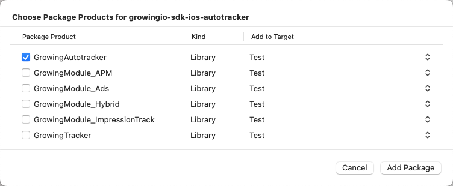

import Tabs from '@theme/Tabs';
import TabItem from '@theme/TabItem';


### 集成准备
#### 获取 SDK 初始化必传参数：Account ID、DataSource ID、URL Scheme、Host
:::info
AccountID：项目 ID，代表一个项目<br/>
DataSourceID：数据源 ID，代表一个数据源<br/>
URL Scheme： 是 GrowingIO SDK 从外部唤醒应用时使用的唯一标识<br/>
Host：采集数据上报的服务器地址<br/>

Account ID、DataSource ID、URL Scheme 需要在 CDP 增长平台上新建数据获取源，或从已知应用中获取, 如不清楚或无权限请联系您的专属项目经理或技术支持<br/>
Host 需要服务端部署，如不清楚请联系您的专属项目经理或技术支持
:::

##### 创建

##### 查看


## 无埋点 SDK 集成
:::info
**3.3.5 版本及以上，Swift 项目建议使用 SwiftPM 集成**

如需使用 Cocoapods 集成 SDK 3.3.5 版本及以上，会出现 `Include of non-modular header inside framework module` 报错，请参考 [<font color='red'>解决方案</font>](/docs/ios/base#include-of-non-modular-header-inside-framework-module-报错解决方案)

:::

<Tabs>
  <TabItem value="cocoapods" label="Cocoapods集成" default>

在您的 Podfile 文件中添加

```c
pod 'GrowingAnalytics-cdp/Autotracker'
```

打开终端，切换到项目目录
执行 `pod install` 或 `pod update`

  </TabItem>
  <TabItem value="swiftPM" label="Swift Package Manager集成">

1. 在 Xcode 菜单栏点击 File -> Add Packages... 或选择工程 -> 对应 Project -> Package Dependencies -> 点击 ➕


2. 搜索 GrowingAnalytics SDK GitHub 地址

```
https://github.com/growingio/growingio-sdk-ios-autotracker.git
```

3. 并设置 Dependency Rule 为 Branch master，Add to Project 选择您所需要的 Project


4. 点击下方的 Add Package 按钮，选择 GrowingAutotracker_cdp，再次点击 Add Package 按钮



  </TabItem>
</Tabs>

### 添加 URL Scheme

URL Scheme 是您在 GrowingIO 平台创建应用时生成的该应用的唯一标识。把 URL Scheme 添加到您的项目，以便使用 Mobile Debugger 等功能时唤醒您的应用。  
:::info
需要在 GrowingIO 网站上先创建您的 App 应用，获取 URL Scheme
:::
选择工程 -> Target -> Info -> URL Types -> 点击 ➕ -> 添加您的 URL Scheme 即可


### SDK 初始化配置
#### 导入头文件 `"GrowingAutotracker.h"`

<Tabs>
  <TabItem value="cocoapods" label="Cocoapods集成" default>

```objc
// Objective-C
#import "GrowingAutotracker.h"

// Swift
import GrowingAnalytics_cdp
```

  </TabItem>

  <TabItem value="swiftPM" label="Swift Package Manager集成">

```swift
import GrowingAutotracker_cdp
```

  </TabItem>

</Tabs>

#### 并将以下代码加在您的 `AppDelegate` 的 `application:didFinishLaunchingWithOptions:` 方法中。为使 App 合规，请参考[合规步骤](/docs/compliance/iosCompliance#合规步骤)

<Tabs>
  <TabItem value="objc" label="Objective-C" default>

```objc
// Config GrowingIO
// YourAccountId eg: 0a1b4118dd954ec3bcc69da5138bdb96
// YourServerHost eg: https://api.growingio.com 需要填写完整的url地址
// YourDatasourceId eg: 11223344aabbcc
GrowingAutotrackConfiguration *configuration = [GrowingAutotrackConfiguration configurationWithProjectId:@"YourAccountId"];
configuration.dataCollectionServerHost = @"YourServerHost";
configuration.dataSourceId = @"YourDatasourceId";
[GrowingAutotracker startWithConfiguration:configuration launchOptions:launchOptions];
```
  </TabItem>

  <TabItem value="swift" label="Swift">

```swift
// Config GrowingIO
// YourAccountId eg: 0a1b4118dd954ec3bcc69da5138bdb96
// YourServerHost eg: https://api.growingio.com 需要填写完整的url地址
// YourDatasourceId eg: 11223344aabbcc
let config = GrowingAutotrackConfiguration(projectId: "YourAccountId")
config?.dataCollectionServerHost = "YourServerHost"
config?.dataSourceId = "YourDatasourceId"
GrowingAutotracker.start(with: config!, launchOptions: launchOptions ?? [:])
```

  </TabItem>

</Tabs>

####  在 appDelegate.m 文件中实现 URL Scheme 跳转以及 DeepLink 跳转的代理方法

<Tabs>
  <TabItem value="objc" label="Objective-C" default>

```objc
// URL Scheme跳转
- (BOOL)application:(UIApplication *)application
            openURL:(NSURL *)url
  sourceApplication:(NSString *)sourceApplication
         annotation:(id)annotation {
    return YES;
}

// universal Link执行
- (BOOL) application:(UIApplication *)application
continueUserActivity:(NSUserActivity *)userActivity
  restorationHandler:(void (^)(NSArray<id <UIUserActivityRestoring>> *_Nullable))restorationHandler {
    return YES;
}
```

  </TabItem>

  <TabItem value="swift" label="Swift">

```swift
// URL Scheme跳转
func application(_ app: UIApplication, open url: URL, options: [UIApplication.OpenURLOptionsKey : Any] = [:]) -> Bool {
    return true
}

// universal Link执行
func application(_ application: UIApplication, continue userActivity: NSUserActivity, restorationHandler: @escaping ([UIUserActivityRestoring]?) -> Void) -> Bool {
    return true
}
```

  </TabItem>

</Tabs>

#### 若使用了 iOS 13 的 UIScene，请在您指定的 SceneDelegate 中设置如下

<Tabs>
  <TabItem value="objc" label="Objective-C" default>

```c
- (void)scene:(UIScene *)scene continueUserActivity:(NSUserActivity *)userActivity {
}

- (void)scene:(UIScene *)scene openURLContexts:(NSSet<UIOpenURLContext *> *)URLContexts {
}
```
  </TabItem>

  <TabItem value="swift" label="Swift">

```swift
func scene(_ scene: UIScene, continue userActivity: NSUserActivity) {
}

func scene(_ scene: UIScene, openURLContexts URLContexts: Set<UIOpenURLContext>) {
}
```

  </TabItem>

</Tabs>

:::info
上述代理方法空实现即可，SDK 会自动加入处理代码
:::

### 查看集成效果
运行应用，若日志中输出了  
`Thank you very much for using GrowingIO. We will do our best to provide you with the best service. GrowingIO version: <iOSSDKVersion />`  
则说明 SDK 已经集成成功。

若在初始化中 `debugEnabled` 设置为 YES，打开了 Debug，则可以在日志中看到每个事件的 log 日志输出。

至此，就完成了无埋点 SDK 的集成。

另外，您可使用 [GioKit 辅助插件](/docs/giokit/ios) 进行集成验证。

## 埋点 SDK 集成

埋点 SDK 只自动采集用户访问事件和 APP 关闭事件，其他事件均需要开发同学调用相应埋点 API 采集埋点事件。

:::info
**3.3.5 版本及以上，Swift 项目建议使用 SwiftPM 集成**

如需使用 Cocoapods 集成 SDK 3.3.5 版本及以上，会出现 `Include of non-modular header inside framework module` 报错，请参考 [<font color='red'>解决方案</font>](/docs/ios/base#include-of-non-modular-header-inside-framework-module-报错解决方案)

:::

<Tabs>
  <TabItem value="cocoapods" label="Cocoapods集成" default>

在您的 Podfile 文件中添加

```c
pod 'GrowingAnalytics-cdp/Tracker'
```

打开终端，切换到项目目录
执行 `pod install` 或 `pod update`

  </TabItem>
  <TabItem value="swiftPM" label="Swift Package Manager集成">

1. 在 Xcode 菜单栏点击 File -> Add Packages... 或选择工程 -> 对应 Project -> Package Dependencies -> 点击 ➕


2. 搜索 GrowingAnalytics SDK GitHub 地址

```
https://github.com/growingio/growingio-sdk-ios-autotracker.git
```

3. 并设置 Dependency Rule 为 Branch master，Add to Project 选择您所需要的 Project


4. 点击下方的 Add Package 按钮，选择 GrowingTracker_cdp，再次点击 Add Package 按钮


  </TabItem>
</Tabs>

### 添加 URL Scheme

URL Scheme 是您在 GrowingIO 平台创建应用时生成的该应用的唯一标识。把 URL Scheme 添加到您的项目，以便使用 Mobile Debugger 等功能时唤醒您的应用。  
:::info
您需要在 CDP 增长平台上先创建您的 App 应用，获取 URL Scheme
:::
选择工程 -> Target -> Info -> URL Types -> 点击 ➕ -> 添加您的 URL Scheme 即可


### SDK初始化配置
#### 导入头文件 `"GrowingTracker.h"`

<Tabs>
  <TabItem value="cocoapods" label="Cocoapods集成" default>

```objc
// Objective-C
#import "GrowingTracker.h"

// Swift
import GrowingAnalytics_cdp
```

  </TabItem>

  <TabItem value="swiftPM" label="Swift Package Manager集成">

```swift
import GrowingTracker_cdp
```

  </TabItem>

</Tabs>

#### 并将以下代码加在您的 `AppDelegate` 的 `application:didFinishLaunchingWithOptions:` 方法中。为使 App 合规，请参考[合规步骤](/docs/compliance/iosCompliance#合规步骤)

<Tabs>
  <TabItem value="objc" label="Objective-C" default>

```objc
// Config GrowingIO
// YourAccountId eg: 0a1b4118dd954ec3bcc69da5138bdb96
// YourServerHost eg: https://api.growingio.com 需要填写完整的url地址
// YourDatasourceId eg: 11223344aabbcc
GrowingTrackConfiguration *configuration = [GrowingTrackConfiguration configurationWithProjectId:@"YourAccountId"];
configuration.dataCollectionServerHost = @"YourServerHost";
configuration.dataSourceId = @"YourDatasourceId";
[GrowingTracker startWithConfiguration:configuration launchOptions:launchOptions];
```
  </TabItem>

  <TabItem value="swift" label="Swift">

```swift
// Config GrowingIO
// YourAccountId eg: 0a1b4118dd954ec3bcc69da5138bdb96
// YourServerHost eg: https://api.growingio.com 需要填写完整的url地址
// YourDatasourceId eg: 11223344aabbcc
let config = GrowingTrackConfiguration(projectId: "YourAccountId")
config?.dataCollectionServerHost = "YourServerHost"
config?.dataSourceId = "YourDatasourceId"
GrowingTracker.start(with: config!, launchOptions: launchOptions ?? [:])
```

  </TabItem>

</Tabs>

####  在 appDelegate.m 文件中实现 URL Scheme 跳转以及 DeepLink 跳转的代理方法

<Tabs>
  <TabItem value="objc" label="Objective-C" default>

```objc
// URL Scheme跳转
- (BOOL)application:(UIApplication *)application
            openURL:(NSURL *)url
  sourceApplication:(NSString *)sourceApplication
         annotation:(id)annotation {
    return YES;
}

// universal Link执行
- (BOOL) application:(UIApplication *)application
continueUserActivity:(NSUserActivity *)userActivity
  restorationHandler:(void (^)(NSArray<id <UIUserActivityRestoring>> *_Nullable))restorationHandler {
    return YES;
}
```

  </TabItem>

  <TabItem value="swift" label="Swift">

```swift
// URL Scheme跳转
func application(_ app: UIApplication, open url: URL, options: [UIApplication.OpenURLOptionsKey : Any] = [:]) -> Bool {
    return true
}

// universal Link执行
func application(_ application: UIApplication, continue userActivity: NSUserActivity, restorationHandler: @escaping ([UIUserActivityRestoring]?) -> Void) -> Bool {
    return true
}
```

  </TabItem>

</Tabs>

#### 若使用了 iOS 13 的 UIScene，请在您指定的 SceneDelegate 中设置如下

<Tabs>
  <TabItem value="objc" label="Objective-C" default>

```c
- (void)scene:(UIScene *)scene continueUserActivity:(NSUserActivity *)userActivity {
}

- (void)scene:(UIScene *)scene openURLContexts:(NSSet<UIOpenURLContext *> *)URLContexts {
}
```
  </TabItem>

  <TabItem value="swift" label="Swift">

```swift
func scene(_ scene: UIScene, continue userActivity: NSUserActivity) {
}

func scene(_ scene: UIScene, openURLContexts URLContexts: Set<UIOpenURLContext>) {
}
```

  </TabItem>

</Tabs>

:::info
上述代理方法空实现即可，SDK 会自动加入处理代码
:::

### 查看集成效果
运行应用，若日志中输出了  
`Thank you very much for using GrowingIO. We will do our best to provide you with the best service. GrowingIO version: <iOSSDKVersion />`  
则说明 SDK 已经集成成功。

若在初始化中 `debugEnabled` 设置为 YES，打开了 Debug ，则可以在日志中看到每个事件的 log 日志输出。

至此，就完成了埋点 SDK 的集成。

另外，您可使用 [GioKit 辅助插件](/docs/giokit/ios) 进行集成验证。

## App Store 提交应用注意事项
如果您添加了库 `AdSupport.framework`，GrowingIO 则会启用 `IDFA`，所以在向 App Store 提交应用时，需要：

1. 对于问题 Does this app use the Advertising Identifier (IDFA)，选择 YES。

2. 对于选项 Attribute this app installation to a previously served advertisement，打勾。

3. 对于选项 Attribute an action taken within this app to a previously served advertisement，打勾。

:::info
Q: 为什么 GrowingIO SDK 使用 `IDFA`? <br/>
A: GrowingIO 使用 `IDFA` 来做来源管理激活设备的精确匹配，让您更好的衡量广告效果。如果您不希望启用 `IDFA`，可以选择不引入 `AdSupport.framework`
:::

### 关于 IDFA 权限获取
* 对于 iOS 14 之前，您无需主动获取 广告标识`IDFA`的权限

* 对于 iOS 14 之后，您需要使用如下方法来开启您的 广告标识`IDFA` 的权限
  

:::info
2021 年 4 月 27 日，iOS 14.5 正式发布，新版本的 iOS 最主要变化如下：

自 iOS14.5、iPadOS 14.5 和 tvOS 14.5 开始，所有 App 都必须使用 `AppTrackingTransparency` 框架来征得用户的许可，才能对其进行跟踪或访问其设备的广告标识符。

And starting with iOS 14.5, iPadOS 14.5, and tvOS 14.5, you’ll be required to ask users for their permission to track them across apps and websites owned by other companies.
:::

1. Plist 文件中添加 `NSUserTrackingUsageDescription`

```c
<key>NSUserTrackingUsageDescription</key>
<string>GrowingIO测试demo 需要使用您的广告标识信息以用于数据追踪分析</string> //描述内容请根据App修改
```

2. 导入框架 `#import <AppTrackingTransparency/AppTrackingTransparency.h>`

3. 调用获取权限代码
```c

- (void)applicationDidBecomeActive:(UIApplication *)application {
  // 调用AppTrackingTransparency相关实现请在ApplicationDidBecomeActive之后，适配iOS 15
  // 参考: https://developer.apple.com/forums/thread/690607?answerId=688798022#688798022
  if (@available(iOS 14, *)) {
     // iOS14及以上版本需要先请求权限
     [ATTrackingManager requestTrackingAuthorizationWithCompletionHandler:^(ATTrackingManagerAuthorizationStatus status) {
         switch (status) {
             case ATTrackingManagerAuthorizationStatusDenied:
                 //用户拒绝向App授权
                 break;
             case ATTrackingManagerAuthorizationStatusAuthorized:
                 //用户同意向App授权
                 break;
             case ATTrackingManagerAuthorizationStatusNotDetermined:
                 //用户未做选择或未弹窗
                 break;
             case ATTrackingManagerAuthorizationStatusRestricted:
                 //用户在系统级别开启了限制广告追踪
                 break;
             default:
                 break;
         }
     }];
 }
}
```

### 关于使用 IDFA 作为访问用户ID
GrowingIO SDK 使用 访问用户 ID 标识访问用户 ，其值使用 IDFA 、IDFV 或随机字符串 ，三者的优先级为 IDFA > IDFV > 随机字符串 ，例如：如果获取不到 IDFA，SDK 会使用 IDFV 作为访问用户 ID。

访问用户 ID 生成时机是在 SDK 第一次初始化时，生成之后会被存储在 Keychain 中，如果 Keychain 数据一直存在，则访问用户 ID 不会发生改变。

如果需要使用 IDFA 作为访问用户 ID，则需要在请求获取 IDFA 权限之后再初始化 SDK。如果用户不允许广告跟踪，则会按照 IDFV > 随机字符串的逻辑生成访问用户 ID。

```c
- (void)applicationDidBecomeActive:(UIApplication *)application {
  // 调用AppTrackingTransparency相关实现请在ApplicationDidBecomeActive之后，适配iOS 15
  // 参考: https://developer.apple.com/forums/thread/690607?answerId=688798022#688798022
  if (@available(iOS 14, *)) {
    [ATTrackingManager requestTrackingAuthorizationWithCompletionHandler:^(ATTrackingManagerAuthorizationStatus status) {
      // 初始化 GrowingIO SDK
    }];
  } else {
    // 初始化 GrowingIO SDK
  }
}
```
:::warning 注意
使用 IDFA 作为访问用户 ID，同时为使 App 合规，则第一次 SDK 初始化应该在 用户同意隐私协议和获取 IDFA 权限之后。参考[合规步骤](/docs/compliance/iosCompliance#合规步骤)
:::

## 集成问题

### Include of non-modular header inside framework module 报错解决方案

Swift 项目如需使用 Cocoapods 集成 SDK 3.3.5 版本及以上，会出现 `Include of non-modular header inside framework module` 报错，修改方式有以下 2 种：

- 手动添加 Module 形式导入

  需手动修改 Pods/GrowingAnalytics-cdp/Autotracker/GrowingAutotracker.h，添加 `@import GrowingAnalytics;`，示例如下：

  ```
  #import <UIKit/UIKit.h>
  @import GrowingAnalytics; // 添加此module形式导入，避免Include of non-modular header inside framework module报错
  #import "GrowingAttributesBuilder.h"
  #import "GrowingAutotrackConfiguration.h"
  #import "GrowingDynamicProxy.h"
  #import "GrowingTrackConfiguration+CdpTracker.h"
  ```

  同理，如集成 `pod 'GrowingAnalytics-cdp/Tracker'`，也需对 Pods/GrowingAnalytics-cdp/Tracker/GrowingTracker.h 进行如上调整

- 修改 OTHER_SWIFT_FLAGS

  设置 OTHER_SWIFT_FLAGS 为 `-Xcc -Wno-error=non-modular-include-in-framework-module`

