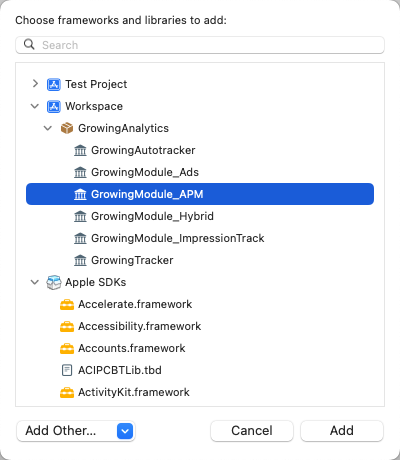

import Tabs from '@theme/Tabs';
import TabItem from '@theme/TabItem';

APM (Application Performance Management) 即应用性能管理，属于 IT 运维管理 (ITOM) 范畴。主要是针对企业关键业务的IT应用性能和用户体验的监测、优化，提高企业 IT 应用的可靠性和质量，保证用户得到良好的服务，降低 IT 总拥有成本 (TCO)。

应用性能分析为企业提供针对应用服务的品质、性能以及自定义埋点的 APM 服务。基于埋点事件定义及海量数据的聚合分析，GIO 可帮助客户发现多类异常问题，并及时报警，做分配处理，同时平台提供了丰富的归因能力，包括且不限于异常分析、事件分析、自定义上报、日志查询等，结合灵活的报表能力可了解各类指标的趋势变化。

GrowingIO 性能监控模块目前提供了 App 崩溃分析，应用启动时间，页面启动时间分析的功能。

--------

:::info
采集 SDK 版本 >=3.4.4

**使用时注意模块版本需要与采集 SDK 版本保持一致**
:::

<Tabs>
  <TabItem value="cocoapods" label="Cocoapods集成" default>

#### 集成 APM

1. 集成 APM 模块

```shell
pod 'GrowingAnalytics/APM'
```

2. 集成 GrowingAPM

```shell
pod 'GrowingAPM'
```

打开终端，切换到项目目录，执行 `pod install` 或 `pod update`

#### 初始化 GrowingAPM

1. 在 main.m 中导入 `#import "GrowingAPMModule.h"`，并在 main 函数中添加代码：

```objectivec
int main(int argc, char * argv[]) {
    // GrowingAPM Swizzling
    [GrowingAPM swizzle:GrowingAPMMonitorsCrash | GrowingAPMMonitorsUserInterface];
    NSString * appDelegateClassName;
    @autoreleasepool {
        // Setup code that might create autoreleased objects goes here.
        appDelegateClassName = NSStringFromClass([AppDelegate class]);
    }
    return UIApplicationMain(argc, argv, nil, appDelegateClassName);
}
```

2. 在 AppDelegate.m 中导入 `#import "GrowingAPMModule.h"`，并在 `application:didFinishLaunchingWithOptions:` 中初始化 GrowingAnalytics SDK 的同时，导入 GrowingAPMConfig 配置:

```objectivec
GrowingAutotrackConfiguration *configuration = [GrowingAutotrackConfiguration configurationWithProjectId:@"YourAccountId"];
configuration.dataCollectionServerHost = @"YourServerHost";
configuration.dataSourceId = @"YourDatasourceId";

// 添加 GrowingAPM 初始化配置
GrowingAPMConfig *config = GrowingAPMConfig.config;
// 根据您需要的监控类型
config.monitors = GrowingAPMMonitorsCrash | GrowingAPMMonitorsUserInterface;
configuration.APMConfig = config;

[GrowingAutotracker startWithConfiguration:configuration launchOptions:launchOptions];
```

#### 其他

另外，如果您仅需要部分 APM 监控功能，可按需集成对应的 GrowingAPM 子模块：

```shell
# GrowingAnalytics/APM 模块
pod 'GrowingAnalytics/APM'

# 按照所需 GrowingAPM 子模块自由组合
pod 'GrowingAPM/UIMonitor'
pod 'GrowingAPM/CrashMonitor'
# ...
```

  </TabItem>
  <TabItem value="swiftPM" label="Swift Package Manager集成">

添加 **GrowingModule_APM** Package



#### 初始化 GrowingAPM

1. 在 **main.swift** 中导入 `import GrowingModule_APM`，并添加以下代码：

```swift
GrowingAPM.swizzle([.crash, .userInterface])
```

2. 在 **AppDelegate.swift** 中导入 `import GrowingModule_APM`，并在 `application:didFinishLaunchingWithOptions:` 中初始化 GrowingAnalytics SDK 的同时，导入 GrowingAPMConfig 配置:

```swift
let config = GrowingAutotrackConfiguration(projectId: "YourAccountId")
config?.dataCollectionServerHost = "YourServerHost"
config?.dataSourceId = "YourDatasourceId"

// 添加 GrowingAPM 初始化配置
let apmconfig = GrowingAPMConfig()
// 根据您需要的监控类型
apmconfig.monitors = [.crash, .userInterface]
config?.apmConfig = apmconfig

GrowingAutotracker.start(with: config!, launchOptions: launchOptions ?? [:])
```

  </TabItem>
</Tabs>
