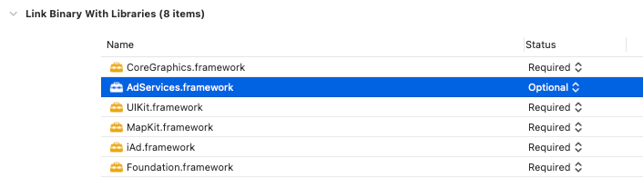
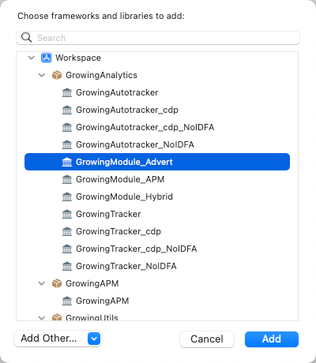

import Tabs from '@theme/Tabs';
import TabItem from '@theme/TabItem';

广告模块包括激活事件和深度链接(DeepLink)，激活事件是当用户应用第一次打开时有且仅发一次的事件，深度链接是提供客户通过活动网页等形式提供App渠道的跳转和下载。 在深度链接技术场景中，可以直接唤起 App 并跳转至指定页面，同时根据条件判断用户跳转路径，当用户已经安装 App 时可以直接唤起 App，当用户未安装 App 时会引导用户下载 App。

--------
:::info

平台版本 >=4.0 支持，具体的深度链接配置可以参考 [获客分析](https://docs.growingio.com/op-help/docs/4.0/product-manual/acquisition-analytics/acquisition-tracing/)

采集 SDK 版本 >=3.4.7

**使用时注意模块版本需要与采集 SDK 版本保持一致**
:::

<Tabs>
  <TabItem value="cocoapods" label="Cocoapods集成" default>

1. 使用 Cocoapods 安装

```shell
pod 'GrowingAnalytics/Advert'
```

打开终端，切换到项目目录，执行 `pod install` 或 `pod update`

2. 在 AppDelegate.m 中导入 `#import "GrowingAdvertising.h"`

### 模块配置

广告模块中提供了相关配置：

| 配置接口               | 参数类型   | 是否必填 | 默认值 | 说明                         |
| :--------------------- | :--------- | :------: | :----- | :--------------------------- |
| `readClipboardEnabled` | `BOOL`     |    否    | `YES`  | 是否允许读取剪切板的应用信息 |
| `deepLinkHost`         | `NSString` |    是    | `nil`  | 深度链接配置地址，示例：https://n.datayi.cn   |
| `deepLinkCallback`     | `Block`    |    否    | `nil`  | 监听深度链接中的地址参数     |

```objectivec
GrowingAutotrackConfiguration *configuration = [GrowingAutotrackConfiguration configurationWithProjectId:@"YourAccountId"];
configuration.dataCollectionServerHost = @"YourServerHost";
configuration.dataSourceId = @"YourDatasourceId";

// 是否允许读取剪切板的应用信息
configuration.readClipboardEnabled = YES;
// 深度链接配置地址
configuration.deepLinkHost = @"Your DeepLinkHost";
// 监听深度链接中的地址参数
configuration.deepLinkCallback = ^(NSDictionary * _Nullable params, 
                                   NSTimeInterval processTime, 
                                   NSError * _Nullable error) {
};

[GrowingAutotracker startWithConfiguration:configuration launchOptions:launchOptions];
```

### 主动触发 DeepLink

可以通过该方法手动发送 DeepLink 事件，该接口常用于应用内部广告获客接收

| 配置接口                    | 参数类型         | 是否必填 | 默认值 | 说明
| :-------------------------   | :------         | :----:  |:------  |:------| 
| `doDeeplinkByUrl` | `NSURL`       | 是      | `null`  | 深度链接URL，示例：https://n.datayi.cn/k4wudMXn  |

```objectivec
[[GrowingAdvertising sharedInstance] doDeeplinkByUrl:[NSURL URLWithString:@"Your DeepLinkUrl"]
                                            callback:^(NSDictionary * _Nullable params,
                                                       NSTimeInterval processTime,
                                                       NSError * _Nullable error) {
        
}];
```

### 获取 Apple Search Ads 归因数据分析

如您需要使用 Apple Search Ads 归因数据分析，在 SDK 初始化时打开 ASAEnabled 开关：

```objectivec
GrowingAutotrackConfiguration *configuration = [GrowingAutotrackConfiguration configurationWithProjectId:@"YourAccountId"];
configuration.dataCollectionServerHost = @"YourServerHost";
configuration.dataSourceId = @"YourDatasourceId";

// 打开 ASAEnabled 开关
configuration.ASAEnabled = YES;

[GrowingAutotracker startWithConfiguration:configuration launchOptions:launchOptions];
```

在 Target -> Build Phases -> Link Binary With Libraries，添加 **iAd.framework** 和 **AdServices.framework**，并设置 AdServices.framework status 为 **Optional**



  </TabItem>
  <TabItem value="swiftPM" label="Swift Package Manager集成">

1. 添加 **GrowingModule_Advert** Package



2. 在 AppDelegate.swift 中导入 `import GrowingModule_Advert`

### 模块配置

广告模块中提供了相关配置：

| 配置接口               | 参数类型   | 是否必填 | 默认值 | 说明                         |
| :--------------------- | :--------- | :------: | :----- | :--------------------------- |
| `readClipboardEnabled` | `Bool`     |    否    | `true` | 是否允许读取剪切板的应用信息 |
| `deepLinkHost`         | `String`   |    是    | `nil`  | 深度链接配置地址，示例：https://n.datayi.cn   |
| `deepLinkCallback`     | `Closures` |    否    | `nil`  | 监听深度链接中的地址参数     |

```swift
let config = GrowingAutotrackConfiguration(projectId: "YourAccountId")
config?.dataCollectionServerHost = "YourServerHost"
config?.dataSourceId = "YourDatasourceId"

// 是否允许读取剪切板的应用信息
config?.readClipboardEnabled = true
// 深度链接配置地址
config?.deepLinkHost = "Your DeepLinkHost"
// 监听深度链接中的地址参数
config?.deepLinkCallback = { (params: [AnyHashable : Any]?, 
                              processTime: TimeInterval, 
                              error: Error?) -> Void in
}

GrowingAutotracker.start(with: config!, launchOptions: launchOptions ?? [:])
```

### 主动触发 DeepLink

可以通过该方法手动发送 DeepLink 事件，该接口常用于应用内部广告获客接收

| 配置接口                    | 参数类型         | 是否必填 | 默认值 | 说明
| :-------------------------   | :------         | :----:  |:------  |:------| 
| `doDeeplink` | `URL`       | 是      | `null`  | 深度链接URL，示例：https://n.datayi.cn/k4wudMXn  |

```swift
let callback = { (params: [AnyHashable : Any]?, 
                  processTime: TimeInterval, 
                  error: Error? ) -> Void in
}
GrowingAdvertising.sharedInstance().doDeeplink(by: URL(string: "Your DeepLinkUrl")!, callback: callback)
```

### 获取 Apple Search Ads 归因数据分析

如您需要使用 Apple Search Ads 归因数据分析，在 SDK 初始化时打开 ASAEnabled 开关：

```swift
let config = GrowingAutotrackConfiguration(projectId: "YourAccountId")
config?.dataCollectionServerHost = "YourServerHost"
config?.dataSourceId = "YourDatasourceId"

// 打开 ASAEnabled 开关
config?.ASAEnabled = true

GrowingAutotracker.start(with: config!, launchOptions: launchOptions ?? [:])
```

在 Target -> Build Phases -> Link Binary With Libraries，添加 **iAd.framework** 和 **AdServices.framework**，并设置 AdServices.framework status 为 **Optional**


  </TabItem>
</Tabs>
