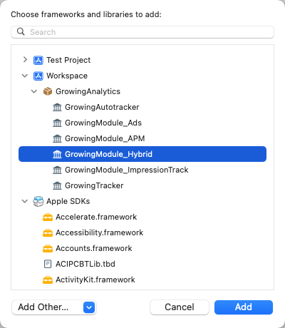

import Tabs from '@theme/Tabs';
import TabItem from '@theme/TabItem';

APP 内嵌 H5 页面如果也需要进行数据采集，H5 页面需要集成 Web JS SDK

若需要 H5 页面 Web JS SDK 采集的数据与 APP 中 GIO SDK 采集的用户等数据打通，请参考：<br/>
WebJS 3.3：[APP内嵌H5页面使用集成](/docs/webjs/3.3/integrate#app内嵌h5页面使用集成)<br/>
WebJS 3.8：[Hybrid内嵌页打通插件](/docs/webjs/3.8/plugins#hybrid内嵌页打通插件giohybridadapter)

如果 APP 集成的是[**无埋点 SDK**](/docs/ios/Introduce#无埋点sdk集成)， 不需要做设置，SDK 会自动注入桥接代码，实现数据打通；

如果 APP 集成的是[**埋点 SDK**](/docs/ios/Introduce#埋点sdk集成)，则需要您添加 Hybrid 依赖

:::info
**使用时注意模块版本需要与采集 SDK 版本保持一致**
:::

<Tabs>
  <TabItem value="cocoapods" label="Cocoapods集成" default>

```c
pod 'GrowingAnalytics/Hybrid'
```

打开终端，切换到项目目录，执行 `pod install` 或 `pod update`

  </TabItem>
  <TabItem value="swiftPM" label="Swift Package Manager集成">

添加 **GrowingModule_Hybrid** Package



  </TabItem>
</Tabs>

项目中无需其他额外设置

:::tip
**1. H5页面 Web JS SDK 采集的数据与APP 中 GIO SDK采集的用户等数据打通规则：**
- 两者 accountId 一致时，H5与APP打通，此时H5页面上采集的数据仅由 APP 中 GIO SDK 发送
- 两者 accountId 不一致时，H5页面上采集的数据同时由 Web JS SDK 和 APP 中 GIO SDK发送
  满足打通设置时，H5 页面调用 setUserID，cleanUserID 会调用 APP 的 setLoginUserID，cleanUserID。

**2. 打通成功效果**
当触发了打通规则，实现打通设置后，h5内嵌页采集的数据经 APP 中 GIO SDK发送数据。以下字段变化如下：<br/>
deviceId: 使用原生App的deviceId<br/>
sessionId: 使用原生App的sessionId<br/>
gioId: 使用原生App的gioId <br/>
userId: 使用原生App的userId<br/>
userKey: 使用原生App的userKey<br/>
dataSourceId: 使用原生App的dataSourceId<br/>
platform: 使用原生App的platform<br/>
domain: 使用H5页面的域名<br/>

用户行为与采集数据描述：用户点击APP内嵌H5页面，由APP原生页面进入H5页面，H5页面集成的采集SDK会把采集的数据转发给APP集成的SDK，再进行上报；H5页面的行为数据中的以上用户信息字段会用APP SDK 采集的用户信息，实现H5页面用户与APP用户信息关联。
:::
