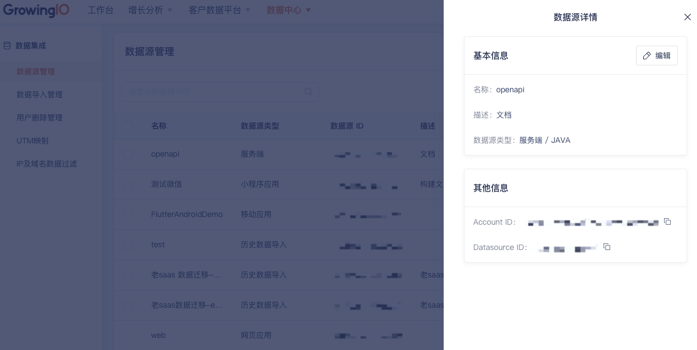

GrowingIO 提供在Python Server端部署的SDK，方便集成后可以快速的进行事件上报操作。
> 兼容 Python2.7+ 和 Python3.5+.

:::info
Python SDK从1.0.10-cdp版本开始使用v3协议进行事件上报, 使用前确认平台版本支持v3协议

支持的平台版本为 OP-13.6、OP-14.x、OP-2.x 版本
:::
## 集成准备
### 获取SDK初始化必传参数：AccountID、DataSourceID、ServerHost
:::info
AccountID：项目ID，代表一个项目<br/>
DataSourceID：数据源ID，代表一个数据源<br/>
ServerHost：采集数据上报的服务器地址<br/>

AccountID、DataSourceID 需要在CDP增长平台上新建数据获取源，或从已知应用中获取, 如不清楚或无权限请联系您的专属项目经理或技术支持<br/>
ServerHost 需要服务端部署，如不清楚请联系您的专属项目经理或技术支持
:::
##### 创建

##### 查看


### 下载 & 安装

可以使用 pip 下载我们的sdk

```cmd
pip install growingio_tracker
```

## 使用说明
### 初始化参数
| 参数         | 必选  | 类型   | 默认值  | 说明                                              |
| :----------- | :---- | :----- | :------ | ------------------------------------------------- |
| product_id    | true  | string |         | 项目 ID,对应 AccountID                              |
| data_source_id | true  | string |         | 数据源 ID,对应 DataSourceID                         |
| server_host   | true  | string |         | 数据收集服务域名,对应 ServerHost ，请参考运维手册或联系技术支持获取 |
| consumer     | false | object |         | 用于配置事件的发送逻辑                                |

**代码示例**
```python
from growingio_tracker import GrowingTracker

# 方式1：使用默认配置
growing_tracker = GrowingTracker('<product_id>', '<data_source_id>', '<server_host>')

# 方式2: 自定义发送策略
from growingio_tracker import DefaultConsumer
default_consumer = DefaultConsumer('<product_id>', '<data_source_id>', '<server_host>')
growing_tracker = GrowingTracker.consumer(default_consumer)
```

### 发送策略
在 Python Sdk 中，提供了不同的事件发送策略，我们可以通过设置不同的策略来配置事件的发送逻辑.

#### 默认策略配置参数

| 参数            | 必选  | 类型   | 默认值  | 说明                                              |
| :-----------   | :---- | :----- | :------ | ------------------------------------------------- |
| product_id     | true  | string |         | 项目 ID,见数据源配置                              |
| data_source_id | true  | string |         | 数据源 ID,见数据源配置                            |
| server_host    | true  | string |         | 数据收集服务域名,请参考运维手册或联系技术支持获取 |
| data_parser    | false | object | JsonParser | 数据格式处理逻辑，默认处理JSON格式                        |
| retry_limit    | false | int    |     3   | 数据上传重试次数                        |
| request_timeout | false | int   |     5   | 数据请求超时时间，默认5秒                       |
| retry_backoff_factor | false | float |     0.25   | 数据上传重试间隔，默认0.25秒               |
| verify_cert   | false | bool   |     True   | 网络请求证书验证                       |

#### 立即发送(默认)
当通过 API 传入事件时，SDK会立即将事件上报。

```python
from growingio_tracker import DefaultConsumer

# 生成事件发送策略
default_consumer = DefaultConsumer('<product_id>', '<data_source_id>', '<server_host>')

# 通过传入发送策略来初始化 SDK
growing_tracker = GrowingTracker.consumer(default_consumer)
```

#### 队列发送
只有当队列事件数目达到设置的队列最大值时才会上传数据。

| 额外参数            | 必选  | 类型   | 默认值  | 说明                                              |
| :-----------   | :---- | :----- | :------ | ------------------------------------------------- |
| max_size | false | int | 500 | 当队列数据达到设置的最大值时，打包上传事件信息，默认最大值为500条 |

```python
from growingio_tracker import BufferedConsumer

buffer_consumer = BufferedConsumer('<product_id>', '<data_source_id>', '<server_host>')
growing_tracker = GrowingTracker.consumer(buffer_consumer)

```

#### 异步队列发送
队列发送的异步版，当队列事件数目达到设置的队列最大值时或者超过设置的定时时间后才会上传数据。

| 额外参数            | 必选  | 类型   | 默认值  | 说明     |
| :-----------   | :---- | :----- | :------ | ------------------------------------------------- |
| flush_after | false | int | 10 | 每隔一定时间发送队列中的数据，默认时间为10秒 |
| max_size | false | int | 500 | 当队列数据达到设置的最大值时，打包上传事件信息，默认最大值为500条 |

```python
from growingio_tracker import AsyncBufferedConsumer

async_consumer = AsyncBufferedConsumer('<product_id>', '<data_source_id>', '<server_host>')
growing_tracker = GrowingTracker.consumer(async_consumer)

```

#### 日志测试
用于打印日志，请在测试环境中使用。
```python
from growingio_tracker import DebugConsumer

# 生成事件发送策略
debug_consumer = DebugConsumer('<product_id>', '<data_source_id>', '<server_host>')

# 通过传入发送策略来初始化 SDK
growing_tracker = GrowingTracker.consumer(debug_consumer)
```


### API接口使用

#### 自定义埋点事件
发送一个埋点事件。在添加发送的埋点事件代码之前，需在CDP平台事件管理界面创建埋点事件以及关联事件属性

**参数说明**

| 参数         | 必选  | 类型   | 默认值  | 说明                        |
| :----------- | :---- | :----- | :------ | --------------------------- |
| event_name   | true | string |         | 事件名, 事件标识符                |
| event_time  | false | long |         | 当前时间戳            |
| anonymous_id | false | string |  | 设备信息 |
| login_user_key | false | string |         | 登录用户类型                |
| login_user_id  | true  | string |         | 登录用户id                  |
| attributes   | false | dict  | None | 事件发生时,所伴随的维度信息 |

**代码示例**
```php
growing_tracker.track_custom_event("test", login_user_id='cpacm', login_user_key='email',
                               attributes={'name': 'cpacm', 'age': '100'})
```

### 登录用户属性事件
以登录用户的身份定义登录用户属性，比如年龄、性别、会员等级等，用于用户信息相关分析<br/>
在添加登录用户属性代码之前，需要在CDP平台用户管理界面中创建用户属性

**参数说明**

| 参数         | 必选  | 类型   | 默认值  | 说明                        |
| :----------- | :---- | :----- | :------ | --------------------------- |
| login_user_key | false | string |         | 登录用户类型                |
| login_user_id  | true  | string |         | 登录用户id                  |
| event_time  | false | long |         | 当前时间戳            |
| anonymous_id | false | string |   |  设备信息 |
| attributes   | false | dict  | None | 事件发生时,所伴随的维度信息 |

**代码示例**
```python
growing_tracker.track_user(login_user_id='user', login_user_key='email',attributes={'name': 'cpacm', 'age': '100'})
```

### 维度表(CDP平台版本>=2.1)
上传一个维度表记录。在添加所需要上传维度表记录代码之前，需要在维度表管理界面中创建对应维度表及其属性

**参数说明**

| 参数       | 必选  | 类型   | 默认值  | 说明             |
| :--------- | :---- | :----- | :------ | ---------------- |
| item_key     | true  | string |         | 物品模型key      |
| item_id    | true  | string |         | 物品模型id      |
| item_attrs | false | dict  | None | 物品模型属性信息 |

**代码示例**
```php
growing_tracker.submit_item('item_key', 'item_name', item_attrs={'attr': 'item'})
```

### 数据格式
python sdk 可以通过配置数据解析器来改变数据上传的格式，SDK 中默认提供了 [snappy](https://github.com/google/snappy) 的处理逻辑。

#### 使用 Snappy 压缩数据

> 要求安装 python-snappy 依赖库 ： pip install python-snappy

| 参数       | 必选  | 类型   | 默认值  | 说明             |
| :--------- | :---- | :----- | :------ | ---------------- |
| crypt_data     | false  | bool |  False  | 是否对数据进行异或加密（只对python3+有效）      |

```python
from growingio_tracker import DefaultConsumer
from growingio_tracker_snappy import SnappyParser

data_parser = SnappyParser()
default_consumer = DefaultConsumer('<product_id>', '<data_source_id>', '<server_host>', data_parser)
growing_tracker = GrowingTracker.consumer(default_consumer)
```

## 集成代码示例一览

```python
# -*- coding: utf-8 -*-

import time
from growingio_tracker import GrowingTracker
from growingio_tracker import DefaultConsumer
from growingio_tracker import BufferedConsumer
from growingio_tracker import AsyncBufferedConsumer
from growingio_tracker_snappy import SnappyParser

if __name__ == '__main__':

    def tracker_consumer():
        buffer_consumer = BufferedConsumer('<product_id>', '<data_source_id>', '<server_host>')
        growing_tracker = GrowingTracker.consumer(buffer_consumer)
        for num in range(0, 3):
            growing_tracker.track_custom_event("tracker_consumer", attributes={'num': num})
        growing_tracker.submit_item('tracker_consumer', 'python', item_attrs={'consumer': 'consumer'})

        for num in range(3, 5):
            growing_tracker.track_custom_event("tracker_consumer", attributes={'num': num})

        buffer_consumer.flush()


    def tracker_test():
        growing_tracker = GrowingTracker('<product_id>', '<data_source_id>', '<server_host>')
        growing_tracker.track_custom_event("test", attributes={'name': 'cpacm', 'age': '100'},
                                           login_user_id='user', login_user_key='email')

        growing_tracker.track_user(login_user_id='user', login_user_key='email',attributes={'name': 'cpacm', 'age': '100'})
        growing_tracker.submit_item('item_key', 'item_name', item_attrs={'attr': 'item'})


    def tracker_async():
        async_consumer = AsyncBufferedConsumer('<product_id>', '<data_source_id>', '<server_host>')
        growing_tracker = GrowingTracker.consumer(async_consumer)
        print("<<TEST 1>>\n")
        for num in range(0, 3):
            growing_tracker.track_custom_event("tracker_async", attributes={'num': num})
        growing_tracker.submit_item('tracker_async', 'python', item_attrs={'consumer': 'consumer'})

        time.sleep(3)
        print("<<TEST 2>>\n")
        for num in range(3, 6):
            growing_tracker.track_custom_event("test2", attributes={'num': num})

        time.sleep(10)
        print("<<TEST 3>>")
        growing_tracker.track_custom_event("test3", attributes={'num': 'last'})

        time.sleep(15)
        async_consumer.stop()
        print("<<END>>")


    def tracker_snappy():
        data_parser = SnappyParser()
        default_consumer = DefaultConsumer('<product_id>', '<data_source_id>', '<server_host>', data_parser)
        growing_tracker = GrowingTracker.consumer(default_consumer)
        growing_tracker.track_custom_event("tracker_snappy", attributes={'name': 'cpacm', 'age': '100'},
                                           login_user_id='user', login_user_key='email')

    tracker_test()
    tracker_consumer()
    tracker_async()
    tracker_snappy()

```

