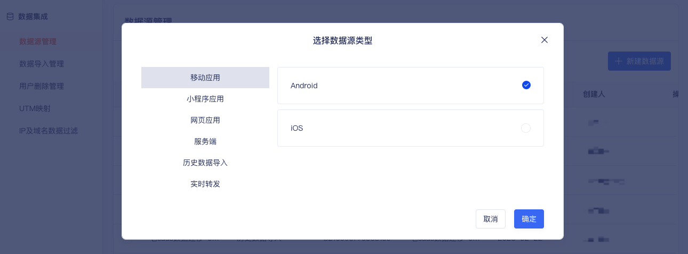

### 集成准备
#### 获取SDK初始化必传参数：AccountID、DataSourceID、Host
:::info
AccountID：项目ID，代表一个项目<br/>
DataSourceID：数据源ID，代表一个数据源<br/>
Host：采集数据上报的服务器地址，非平台地址<br/>

AccountID、DataSourceID 需要在CDP增长平台上新建数据源，或从已创建的数据源中获取, 如不清楚或无权限请联系您的专属项目经理或技术支持
:::
##### 创建

##### 查看


## Web JS SDK集成
### Web使用集成

请将以下的页面代码放置到需要分析的页面中的`<head> 和 </head>`标签之间，即可完成最新 Web JS SDK 页面代码的添加。
:::info
请注意使用具体的项目ID替换代码中的 your accountId、your DataSourceId 确保JS资源地址正确。

JS资源地址：https://assets.giocdn.com/sdk/cdp/gio.js
:::
```html
<script type='text/javascript'>
  (function(window, document, script, src, namespace) {
    window[namespace] = window[namespace] || function() {
      (window[namespace].q = window[namespace].q || []).push(arguments)
    };
    script = document.createElement('script');
    let tag = document.getElementsByTagName('script')[0];
    script.async = true;
    script.src = src;
    tag.parentNode.insertBefore(script, tag);
  })(window, document, 'script', 'JS 资源地址', 'gdp');

  // Config GrowingIO
  // YourAccountId eg: 0a1b4118dd954ec3bcc69da5138bdb96
  // YourServerHost eg: api.growingio.com 仅需填写对应host
  // YourDatasourceId eg: 11223344aabbcc
  gdp('init', 'your accountId', 'your dataSourceId', {
    host: 'your apiServerHost',
    version: '1.0.0'
  });
  gdp('send');
</script>
```
**请注意：我们不建议您在`init`和`send`方法之间做设置用户信息的操作，可能会漏发用户访问上报导致访问数据不准确。**

### APP内嵌H5页面使用集成

集成方式和web使用集成一致；Web JS SDK会自动判断桥的情况进行数据的转发，详见[Hybrid打通插件](/docs/webjs/plugins#6-hybrid打通插件)。

### 小程序内嵌页使用集成
小程序内嵌页集成方式和 Web 页面使用集成添加的跟踪代码一致；
如果有和小程序数据进行用户打通的需求，这时就需要在SDK初始化时填写您小程序的 accountId，AppId 来作为打通的判断，详见[小程序内嵌页打通插件](/docs/webjs/plugins#7-小程序内嵌页打通插件)。
:::info
请注意使用具体的项目ID替换代码中的 your accountId、your DataSourceId 确保JS资源地址正确。

JS资源地址：https://assets.giocdn.com/sdk/cdp/gio.js
:::
```html
<script type='text/javascript'>
  (function(window, document, script, src, namespace) {
    window[namespace] = window[namespace] || function() {
      (window[namespace].q = window[namespace].q || []).push(arguments)
    };
    script = document.createElement('script');
    let tag = document.getElementsByTagName('script')[0];
    script.async = true;
    script.src = src;
    tag.parentNode.insertBefore(script, tag);
  })(window, document, 'script', 'JS 资源地址', 'gdp');
  // Config GrowingIO
  // YourAccountId eg: 0a1b4118dd954ec3bcc69da5138bdb96
  // YourServerHost eg: api.growingio.com 仅需填写对应host
  // YourDatasourceId eg: 11223344aabbcc
  // YourAppId 小程序的APPID eg: wx678908r0r8rfgnvf

  gdp('init', 'your accountId', 'your dataSourceId', 'your AppId', {
    host: 'your apiServerHost',
    version: '1.0.0'
  });
  gdp('send');
</script>
```

## SDK调试
输入`vds`,按下回车键，可查看SDK初始化配置信息。
在SDK初始化时将`debug`配置项设置为`true`，即可在 Console中查看SDK日志，包括采集的数据，示例如下：

```js
gdp('init', 'your accountId', 'your dataSourceId', {
  host: 'your apiServerHost', 
  version: '1.0.0',
  debug: true  // 打开debug调试能力
});
```

打开debug模式便可以在控制台中看到所有上报事件的日志输出，类似如图


## 常见的初始化失败情况

#### 1. 初始化时需设置 host、accountId、datasourceId，否则初始化失败。
#### 2. 初始化 GrowingIO SDK失败。暂不支持 localhost，127.0.0.1

请检查加载的页面链接是否是 不支持file协议（3.2.0版本起支持）、localhost、127.0.0.1；

Web JS SDK 默认是不会采集本地页面（域名为 localhost 或者 file:// 协议），如果您希望 SDK 采集本地页面，需要在集成 SDK 代码的**最前面**添加如下代码：
window._gr_ignore_local_rule=true; //开启本地页面采集

