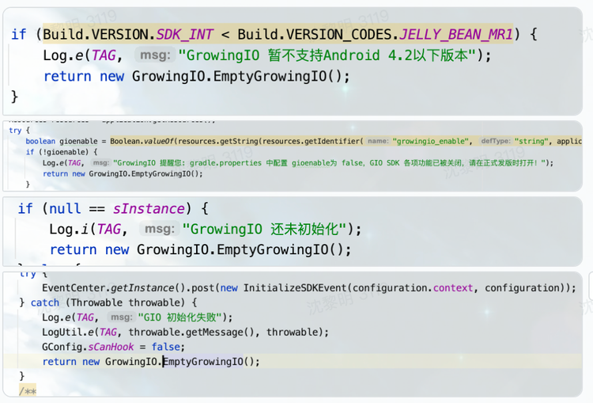
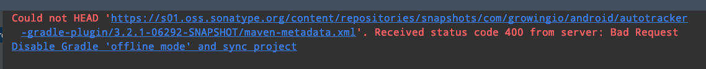

### 1. 集成SDK后本地运行打包没问题，线上自动化打包发现SDK报错，该怎么处理？
**A:** 需要排查线上打包环境与本地环境哪里不一致，并非SDK 的问题

### 4. Android 运行报错NoClassDefFoundError，该怎么处理？
**A:**确认手动安装debug包后依然崩溃的话，麻烦您注释所有混淆代码再试一次，看是否会崩溃。
让客户试试把混淆代码都注释试试。类找不到一般都是未正常混淆代码<br/>
如果以上办法还未解决参考如下：<br/>
①查看初始化是否正确onCreate()添加的顺序是否正确，一定要先执行super.onCreate();再初始化GrowingIO，在BaseApplication<br/>
②检查debug模式下类比release多，分成两个dex包了<br/>
③查看手机系统6.0默认支持multidex的，4.4太低了，继承一下MultiDexApplication就都可以支持了

### 5. Android SDK 获取访问用户ID 返回 null，是在初始化之后获取的，可能是什么原因？
**A:**
初始化失败的时候，会返回有个EmptyGrowingIO,此时调用就会返回null。看下初始化growing的log日志，失败会在在log中输出有对应的原因。
已知的失败原因有如下代码判断：<br/>


### 6. Android SDK 包文件同步报错，或报找不到包文件，包文件不存在，该怎么处理？
Could not HEAD. Received status code 400 from server: Bad Request<br/>
<br/>
**A:** 在开发工具中按照如下步骤进行操作<br/>
1. Preferences->Appearance & Behavior->System Settings->HTTP Proxy 设置为 No proxy<br/>
2. 去掉项目中 gradle.properties 里的代理配置信息<br/>
3. 去掉 .gradle/gradle.properties 里的代理配置信息<br/>
4. 重试 sync

### 7.Android 打包的问题， Invalid opcode 169
提示：<br/>
[Autotrack.error] Unfortunately, an error has occurred while processing com/google/iot/protobuf/DescriptorProtos$UninterpretedOption. Please copy your build logs and the jar containing this class and visit https://www.growingio.com, thanks!  Invalid opcode 169<br/>
**A:**这个是asm 7.0上的问题，问题源自： https://gitlab.ow2.org/asm/asm/-/issues/317873<br/>
客户可以在编译配置的时候 exclude 这个包 “com/google/iot”<br/>
agp7.0之后使用了asm7.0的库，asm7.0对java1.6编译的类处理有问题，确认一下这个类来自哪个包，如果没有注入的需要可以exclude掉这个package或者不处理这个异常<br/>
./gradlew buildEnvironment 可以看哪个插件依赖了 asm7.0的库<br/>
如果需要解决这个问题可以依赖asm 7.2的版本修复<br/>
这是asm上的issue以及修复的commit<br/>
issue: https://gitlab.ow2.org/asm/asm/-/issues/317873<br/>
commit: https://gitlab.ow2.org/asm/asm/-/commit/c4241012de8e0502dfe98bd036ab469e622e06fc

### 8.延迟初始化之后，发现丢掉了部分事件，为什么？
**A：**对于SDK初始化之前，或者开启数据采集之前发生的事件，一概丢弃。

### 9.什么是 SNAPSHOT 版本？
**A：**拥有该后缀的SDK版本属于测试阶段的SDK快照版本，在完成测试后会将其转为正式版本。
若要使用提前使用该版本，请在 project 级别的 `build.gradle` 下添加以下依赖包仓库
```groovy
//如果你的版本为 xxx-SNAPSHOT 版本，则需要加入该仓库。与 mavenCentral() 同级
maven { url "https://oss.sonatype.org/content/repositories/snapshots/" }
```

### 10.若minSdkTarget Android5.0及以下使用了 `multidex`该怎么处理？
**A：**需要在app的build.gradle中添加如下配置将sdk中contentprovider添加到主dex中 具体配置方式可以参考 [multiDexKeepFile 属性](https://developer.android.google.cn/studio/build/multidex?hl=zh_cn#multidexkeepfile-property)
```groovy
android {
    buildTypes {
        release {
            multiDexKeepFile file('multidex-config.txt')
            ...
        }
    }
}
```
并在 `multidex-config.txt` 中增加如下类
```xml
com/growingio/android/sdk/track/middleware/EventsContentProvider.class
com/growingio/android/sdk/track/middleware/EventsInfoTable.class
com/growingio/android/sdk/track/middleware/EventsSQLiteOpenHelper.class
```

### 11. `autotracker-gradle-plugin`默认依赖版本是多少？如何在低版本中使用？
**A：**
`autotracker-gradle-plugin`默认依赖了`com.android.tools.build:gradle:3.3.0`, 如果希望 在 gradle 低版本中使用该依赖插件，请阻断插件中gradle的版本
```groovy
// 在配置插件依赖时, 通过如下方式引入
classpath("com.growingio.android:autotracker-gradle-plugin:3.3.5") {
    transitive false
} 
```
### 12. APP内嵌H5页面需要与APP访问用户数据打通该怎么集成SDK？
**A：**详细请参[内嵌h5页面数据采集配置](/docs/android/base/Configuration#1-内嵌h5页面数据采集配置)


### 13. SDK如何支持合规和第三方安全检测，以及GDPR（欧盟《一般数据保护条例》）？
**A：**参考[Android SDK合规说明](/docs/compliance/androidCompliance)
